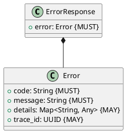

# Error Models

**Context:** Cross-Cutting
**Type:** Documentation
**Version:** 1.0.0
**Date:** 2025-12-04

---

## 1. Overview

Error models define standardized error representations across ModelMora APIs, providing consistent error handling and client experience.

---

## 2. Error Response Structure



---

## 3. Standard Error Response

```json
{
  "error": {
    "code": "MODEL_NOT_FOUND",
    "message": "Model not found in registry",
    "details": {
      "model_id": "invalid/model"
    },
    "trace_id": "55000000-e29b-41d4-a716-446655440017"
  }
}
```

---

## 4. Error Codes

### 4.1 Registry Context Errors

| Code | HTTP Status | Description |
|------|-------------|-------------|
| `MODEL_NOT_FOUND` | 404 | Model does not exist in registry |
| `MODEL_ALREADY_EXISTS` | 409 | Model already registered |
| `VERSION_NOT_FOUND` | 404 | Model version does not exist |
| `VERSION_ALREADY_EXISTS` | 409 | Version already registered for model |
| `INVALID_MODEL_ID` | 400 | Model ID format invalid |
| `INVALID_CHECKSUM` | 400 | Checksum format invalid |
| `ARTIFACT_NOT_ACCESSIBLE` | 400 | Artifact URI not accessible |

### 4.2 Lifecycle Context Errors

| Code | HTTP Status | Description |
|------|-------------|-------------|
| `MODEL_NOT_LOADED` | 404 | Model not currently loaded |
| `MODEL_ALREADY_LOADED` | 409 | Model already in memory |
| `INSUFFICIENT_MEMORY` | 503 | Not enough memory to load model |
| `LOAD_TIMEOUT` | 504 | Model loading timed out |
| `LOAD_FAILED` | 500 | Model loading failed |
| `MODEL_UNHEALTHY` | 503 | Model failed health check |
| `EVICTION_FAILED` | 500 | Failed to evict model |

### 4.3 Inference Context Errors

| Code | HTTP Status | Description |
|------|-------------|-------------|
| `JOB_NOT_FOUND` | 404 | Inference job does not exist |
| `QUEUE_FULL` | 503 | Inference queue at capacity |
| `INVALID_INPUT` | 400 | Input data invalid for task type |
| `INFERENCE_TIMEOUT` | 504 | Inference processing timed out |
| `INFERENCE_FAILED` | 500 | Inference processing failed |
| `JOB_CANCELLED` | 409 | Job was cancelled |
| `CANNOT_CANCEL` | 409 | Job cannot be cancelled (already processing) |

### 4.4 Common Errors

| Code | HTTP Status | Description |
|------|-------------|-------------|
| `VALIDATION_ERROR` | 400 | Request validation failed |
| `UNAUTHORIZED` | 401 | Authentication required |
| `FORBIDDEN` | 403 | Insufficient permissions |
| `INTERNAL_ERROR` | 500 | Unexpected internal error |
| `SERVICE_UNAVAILABLE` | 503 | Service temporarily unavailable |

---

## 5. Validation Error Details

For validation errors, `details` includes field-specific errors:

```json
{
  "error": {
    "code": "VALIDATION_ERROR",
    "message": "Request validation failed",
    "details": {
      "fields": {
        "model_id": ["Model ID cannot be empty"],
        "version": ["Version must match pattern: v{major}.{minor}.{patch}"],
        "resource_requirements.memory_mb": ["Must be greater than 0"]
      }
    }
  }
}
```

---

## 6. Error Exceptions

Domain exceptions map to error codes:

```python
# Registry exceptions
class ModelNotFoundException(Exception):
    code = "MODEL_NOT_FOUND"
    status_code = 404

class ModelAlreadyExistsException(Exception):
    code = "MODEL_ALREADY_EXISTS"
    status_code = 409

# Lifecycle exceptions
class InsufficientMemoryException(Exception):
    code = "INSUFFICIENT_MEMORY"
    status_code = 503

class ModelUnhealthyException(Exception):
    code = "MODEL_UNHEALTHY"
    status_code = 503

# Inference exceptions
class QueueFullException(Exception):
    code = "QUEUE_FULL"
    status_code = 503

class InferenceTimeoutException(Exception):
    code = "INFERENCE_TIMEOUT"
    status_code = 504
```

---

## 7. Error Handler

API layer converts exceptions to error responses:

```python
def exception_to_error_response(exc: Exception, trace_id: UUID = None) -> ErrorResponse:
    """Convert exception to standardized error response"""

    # Domain exception with code
    if hasattr(exc, 'code'):
        return ErrorResponse(
            error=Error(
                code=exc.code,
                message=str(exc),
                details=getattr(exc, 'details', None),
                trace_id=trace_id
            )
        )

    # Validation error
    if isinstance(exc, ValidationError):
        return ErrorResponse(
            error=Error(
                code="VALIDATION_ERROR",
                message="Request validation failed",
                details={"fields": exc.errors},
                trace_id=trace_id
            )
        )

    # Unexpected error
    logger.exception("Unexpected error", exc_info=exc)
    return ErrorResponse(
        error=Error(
            code="INTERNAL_ERROR",
            message="An unexpected error occurred",
            details=None,
            trace_id=trace_id
        )
    )
```

---

## 8. Protocol Buffers

Error representation in gRPC:

```protobuf
message Error {
  string code = 1;
  string message = 2;
  google.protobuf.Struct details = 3;
  string trace_id = 4;
}

message ErrorResponse {
  Error error = 1;
}
```

gRPC status codes:

```python
ERROR_TO_GRPC_STATUS = {
    "MODEL_NOT_FOUND": grpc.StatusCode.NOT_FOUND,
    "MODEL_ALREADY_EXISTS": grpc.StatusCode.ALREADY_EXISTS,
    "VALIDATION_ERROR": grpc.StatusCode.INVALID_ARGUMENT,
    "UNAUTHORIZED": grpc.StatusCode.UNAUTHENTICATED,
    "FORBIDDEN": grpc.StatusCode.PERMISSION_DENIED,
    "INTERNAL_ERROR": grpc.StatusCode.INTERNAL,
    "SERVICE_UNAVAILABLE": grpc.StatusCode.UNAVAILABLE,
    "INFERENCE_TIMEOUT": grpc.StatusCode.DEADLINE_EXCEEDED,
    "QUEUE_FULL": grpc.StatusCode.RESOURCE_EXHAUSTED,
}
```

---

## 9. Client Error Handling

Example client error handling:

```python
# Python client
try:
    response = client.register_model(request)
except ModelmoraException as e:
    if e.code == "MODEL_ALREADY_EXISTS":
        # Handle duplicate
        logger.warning(f"Model already exists: {e.message}")
    elif e.code == "VALIDATION_ERROR":
        # Handle validation errors
        for field, errors in e.details["fields"].items():
            logger.error(f"{field}: {errors}")
    else:
        # Handle other errors
        logger.error(f"Error: {e.code} - {e.message}")
        raise
```

```typescript
// TypeScript client
try {
  const response = await client.registerModel(request);
} catch (error) {
  if (error.code === 'MODEL_ALREADY_EXISTS') {
    // Handle duplicate
    console.warn(`Model already exists: ${error.message}`);
  } else if (error.code === 'VALIDATION_ERROR') {
    // Handle validation errors
    Object.entries(error.details.fields).forEach(([field, errors]) => {
      console.error(`${field}: ${errors}`);
    });
  } else {
    // Handle other errors
    console.error(`Error: ${error.code} - ${error.message}`);
    throw error;
  }
}
```

---

## 10. Error Logging

Errors should be logged with context:

```python
def log_error(error: Error, context: dict = None):
    """Log error with context"""
    logger.error(
        f"Error: {error.code} - {error.message}",
        extra={
            "error_code": error.code,
            "error_details": error.details,
            "trace_id": str(error.trace_id),
            **(context or {})
        }
    )
```

---

## 11. Related Documentation

- [API Design](../../api_design.md) - API error responses
- [Data Models](../../data_models.md) - Domain model validation
- [Domain Events](../events/domain_events.md) - Error event publishing
