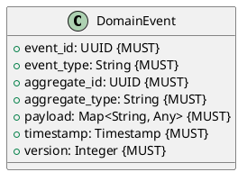

# Domain Events

**Context:** Cross-Cutting
**Type:** Documentation
**Version:** 1.0.0
**Date:** 2025-12-04

---

## 1. Overview

Domain events represent significant state changes in the system. They enable event-driven architecture, loose coupling, and auditability.

---

## 2. Event Pattern

All domain events follow this structure:



---

## 3. Registry Context Events

### 3.1 ModelRegisteredEvent

```json
{
  "event_id": "66000000-e29b-41d4-a716-446655440018",
  "event_type": "model.registered",
  "aggregate_id": "770e8400-e29b-41d4-a716-446655440003",
  "aggregate_type": "model_catalog",
  "payload": {
    "model_id": "sentence-transformers/all-MiniLM-L6-v2",
    "task_type": "txt2embed",
    "version": "v2.2.2"
  },
  "timestamp": "2025-12-04T10:30:00Z",
  "version": 1
}
```

### 3.2 ModelVersionAddedEvent

```json
{
  "event_id": "77000000-e29b-41d4-a716-446655440019",
  "event_type": "model.version.added",
  "aggregate_id": "770e8400-e29b-41d4-a716-446655440003",
  "aggregate_type": "model_catalog",
  "payload": {
    "model_id": "sentence-transformers/all-MiniLM-L6-v2",
    "version": "v2.3.0",
    "checksum": "sha256:new123..."
  },
  "timestamp": "2025-12-04T11:00:00Z",
  "version": 1
}
```

### 3.3 ModelUnregisteredEvent

```json
{
  "event_id": "88000000-e29b-41d4-a716-446655440020",
  "event_type": "model.unregistered",
  "aggregate_id": "770e8400-e29b-41d4-a716-446655440003",
  "aggregate_type": "model_catalog",
  "payload": {
    "model_id": "sentence-transformers/all-MiniLM-L6-v2"
  },
  "timestamp": "2025-12-04T12:00:00Z",
  "version": 1
}
```

---

## 4. Lifecycle Context Events

### 4.1 ModelLoadedEvent

```json
{
  "event_id": "99000000-e29b-41d4-a716-446655440021",
  "event_type": "model.loaded",
  "aggregate_id": "cc0e8400-e29b-41d4-a716-446655440008",
  "aggregate_type": "model_lifecycle_manager",
  "payload": {
    "model_id": "sentence-transformers/all-MiniLM-L6-v2",
    "version": "v2.2.2",
    "memory_mb": 512.5,
    "process_id": 12345
  },
  "timestamp": "2025-12-04T10:25:00Z",
  "version": 1
}
```

### 4.2 ModelUnloadedEvent

```json
{
  "event_id": "aa100000-e29b-41d4-a716-446655440022",
  "event_type": "model.unloaded",
  "aggregate_id": "cc0e8400-e29b-41d4-a716-446655440008",
  "aggregate_type": "model_lifecycle_manager",
  "payload": {
    "model_id": "sentence-transformers/all-MiniLM-L6-v2",
    "reason": "lru_eviction",
    "uptime_seconds": 3600
  },
  "timestamp": "2025-12-04T11:25:00Z",
  "version": 1
}
```

### 4.3 ModelHealthChangedEvent

```json
{
  "event_id": "bb100000-e29b-41d4-a716-446655440023",
  "event_type": "model.health.changed",
  "aggregate_id": "cc0e8400-e29b-41d4-a716-446655440008",
  "aggregate_type": "model_lifecycle_manager",
  "payload": {
    "model_id": "sentence-transformers/all-MiniLM-L6-v2",
    "previous_state": "loaded",
    "new_state": "unhealthy",
    "error_message": "Health check timeout"
  },
  "timestamp": "2025-12-04T10:35:00Z",
  "version": 1
}
```

---

## 5. Inference Context Events

### 5.1 JobSubmittedEvent

```json
{
  "event_id": "cc100000-e29b-41d4-a716-446655440024",
  "event_type": "job.submitted",
  "aggregate_id": "11000000-e29b-41d4-a716-446655440013",
  "aggregate_type": "inference_queue",
  "payload": {
    "job_id": "ee0e8400-e29b-41d4-a716-446655440010",
    "model_id": "sentence-transformers/all-MiniLM-L6-v2",
    "priority": "high"
  },
  "timestamp": "2025-12-04T10:30:00Z",
  "version": 1
}
```

### 5.2 JobCompletedEvent

```json
{
  "event_id": "dd100000-e29b-41d4-a716-446655440025",
  "event_type": "job.completed",
  "aggregate_id": "11000000-e29b-41d4-a716-446655440013",
  "aggregate_type": "inference_queue",
  "payload": {
    "job_id": "ee0e8400-e29b-41d4-a716-446655440010",
    "model_id": "sentence-transformers/all-MiniLM-L6-v2",
    "processing_time_ms": 45.3,
    "success": true
  },
  "timestamp": "2025-12-04T10:30:00.045Z",
  "version": 1
}
```

### 5.3 JobFailedEvent

```json
{
  "event_id": "ee100000-e29b-41d4-a716-446655440026",
  "event_type": "job.failed",
  "aggregate_id": "11000000-e29b-41d4-a716-446655440013",
  "aggregate_type": "inference_queue",
  "payload": {
    "job_id": "ee0e8400-e29b-41d4-a716-446655440010",
    "model_id": "sentence-transformers/all-MiniLM-L6-v2",
    "error_message": "Inference timeout",
    "processing_time_ms": 60000.0
  },
  "timestamp": "2025-12-04T10:31:00Z",
  "version": 1
}
```

---

## 6. Event Publishing

### 6.1 Event Bus Pattern

```python
class EventBus:
    def __init__(self):
        self.handlers = {}

    def subscribe(self, event_type: str, handler: Callable):
        """Subscribe to event type"""
        if event_type not in self.handlers:
            self.handlers[event_type] = []
        self.handlers[event_type].append(handler)

    def publish(self, event: DomainEvent):
        """Publish event to subscribers"""
        if event.event_type in self.handlers:
            for handler in self.handlers[event.event_type]:
                handler(event)
```

### 6.2 Aggregate Event Generation

```python
# In aggregate methods
def register_model(self, model: Model) -> None:
    """Register model and generate event"""
    self.models[model.model_id] = model

    # Generate event
    self.addEvent(DomainEvent(
        event_id=generate_uuid(),
        event_type="model.registered",
        aggregate_id=self.id,
        aggregate_type="model_catalog",
        payload={
            "model_id": str(model.model_id),
            "task_type": model.task_type.toString()
        },
        timestamp=current_timestamp(),
        version=1
    ))
```

---

## 7. Event Store

Events can be persisted for event sourcing:

```sql
CREATE TABLE event_store (
    event_id UUID PRIMARY KEY,
    event_type VARCHAR(255) NOT NULL,
    aggregate_id UUID NOT NULL,
    aggregate_type VARCHAR(255) NOT NULL,
    payload JSONB NOT NULL,
    timestamp TIMESTAMP NOT NULL,
    version INTEGER NOT NULL
);

CREATE INDEX idx_event_store_aggregate ON event_store(aggregate_id);
CREATE INDEX idx_event_store_type ON event_store(event_type);
CREATE INDEX idx_event_store_timestamp ON event_store(timestamp);
```

---

## 8. Kafka Integration

Events can be published to Kafka topics:

```python
# Publish to Kafka
def publish_to_kafka(event: DomainEvent):
    """Publish event to Kafka topic"""
    topic = f"modelmora.{event.aggregate_type}.{event.event_type}"

    kafka_producer.send(
        topic=topic,
        key=str(event.aggregate_id),
        value=event.to_json()
    )
```

---

## 9. Event Handlers

Example event handlers:

```python
# Audit logging
def audit_log_handler(event: DomainEvent):
    """Log all events for audit trail"""
    logger.info(f"Event: {event.event_type}", extra={
        "event_id": str(event.event_id),
        "aggregate_id": str(event.aggregate_id),
        "payload": event.payload
    })

# Metrics
def metrics_handler(event: DomainEvent):
    """Emit metrics for events"""
    if event.event_type == "job.completed":
        emit_metric(
            name="job.processing_time",
            value=event.payload["processing_time_ms"],
            tags={"model_id": event.payload["model_id"]}
        )

# Notifications
def notification_handler(event: DomainEvent):
    """Send notifications for critical events"""
    if event.event_type == "model.health.changed":
        if event.payload["new_state"] == "unhealthy":
            send_alert(f"Model {event.payload['model_id']} unhealthy")
```

---

## 10. Related Documentation

- [Data Models](../../data_models.md) - Domain model specifications
- [API Design](../../api_design.md) - Event-driven API patterns
