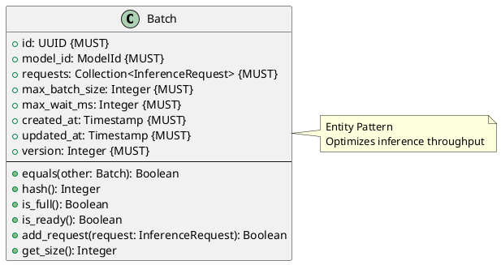

# Batch Entity

**Context:** Inference
**Type:** Entity
**Version:** 1.0.0
**Date:** 2025-12-04

---

## 1. Overview

The `Batch` entity groups multiple inference requests for the same model to enable efficient batch processing.

---

## 2. Structure



---

## 3. Field Specifications

### 3.1 id

- **Type:** UUID
- **Constraint:** MUST
- **Description:** Unique batch identifier

### 3.2 model_id

- **Type:** ModelId
- **Constraint:** MUST
- **Description:** Target model (all requests must match)

### 3.3 requests

- **Type:** Collection\<InferenceRequest>
- **Constraint:** MUST
- **Description:** Requests in this batch

### 3.4 max_batch_size

- **Type:** Integer
- **Constraint:** MUST
- **Default:** 32
- **Description:** Maximum requests per batch

### 3.5 max_wait_ms

- **Type:** Integer
- **Constraint:** MUST
- **Default:** 100
- **Description:** Maximum time to wait before processing

---

## 4. Behavior

```python
def is_full(self) -> bool:
    """Check if batch is at capacity"""
    return len(self.requests) >= self.max_batch_size

def is_ready(self) -> bool:
    """Check if batch should be processed"""
    # Full or wait time exceeded
    if self.is_full():
        return True

    age_ms = (current_timestamp() - self.created_at).total_seconds() * 1000
    return age_ms >= self.max_wait_ms

def add_request(self, request: InferenceRequest) -> bool:
    """Add request to batch"""
    if self.is_full():
        return False

    if request.model_id != self.model_id:
        raise ValueError("Request model_id doesn't match batch")

    self.requests.append(request)
    self.updated_at = current_timestamp()
    self.version += 1
    return True

def get_size(self) -> int:
    """Get current batch size"""
    return len(self.requests)
```

---

## 5. Serialization

```json
{
  "id": "ff0e8400-e29b-41d4-a716-446655440011",
  "model_id": "sentence-transformers/all-MiniLM-L6-v2",
  "requests": [
    {"id": "dd0e8400-e29b-41d4-a716-446655440009", ...},
    {"id": "dd0e8400-e29b-41d4-a716-446655440012", ...}
  ],
  "max_batch_size": 32,
  "max_wait_ms": 100,
  "created_at": "2025-12-04T10:30:00Z",
  "updated_at": "2025-12-04T10:30:00.050Z",
  "version": 2
}
```

---

## 6. Database Schema

```sql
CREATE TABLE batch (
    id UUID PRIMARY KEY,
    model_id VARCHAR(255) NOT NULL,
    max_batch_size INTEGER NOT NULL DEFAULT 32,
    max_wait_ms INTEGER NOT NULL DEFAULT 100,
    created_at TIMESTAMP NOT NULL DEFAULT NOW(),
    updated_at TIMESTAMP NOT NULL DEFAULT NOW(),
    version_number INTEGER NOT NULL DEFAULT 1
);

CREATE TABLE batch_request (
    batch_id UUID NOT NULL REFERENCES batch(id) ON DELETE CASCADE,
    request_id UUID NOT NULL REFERENCES inference_request(id) ON DELETE CASCADE,
    PRIMARY KEY (batch_id, request_id)
);

CREATE INDEX idx_batch_model_id ON batch(model_id);
CREATE INDEX idx_batch_created ON batch(created_at);
```

---

## 7. Usage Example

```python
# Create batch
batch = Batch(
    id=generate_uuid(),
    model_id="sentence-transformers/all-MiniLM-L6-v2",
    requests=[],
    max_batch_size=32,
    max_wait_ms=100,
    created_at=now(),
    updated_at=now(),
    version=1
)

# Add requests
for request in pending_requests:
    if not batch.add_request(request):
        # Batch full, create new one
        break

# Process when ready
if batch.is_ready():
    process_batch(batch)
```

---

## 8. Related Models

- [Inference Request](./inference_request.md) - Batched requests
- [Inference Queue](./inference_queue.md) - Manages batches
