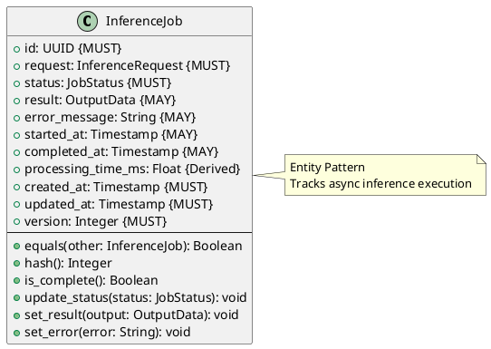

# Inference Job Entity

**Context:** Inference
**Type:** Entity
**Version:** 1.0.0
**Date:** 2025-12-04

---

## 1. Overview

The `InferenceJob` entity tracks the lifecycle and results of an inference request, including status, timing, and output.

---

## 2. Structure



---

## 3. Field Specifications

### 3.1 id

- **Type:** UUID
- **Constraint:** MUST
- **Description:** Unique job identifier

### 3.2 request

- **Type:** InferenceRequest
- **Constraint:** MUST
- **Description:** Original inference request

### 3.3 status

- **Type:** JobStatus
- **Constraint:** MUST
- **Description:** Current job status

### 3.4 result

- **Type:** OutputData
- **Constraint:** MAY
- **Description:** Inference output (when completed)

### 3.5 error_message

- **Type:** String
- **Constraint:** MAY
- **Description:** Error details (when failed)

### 3.6 started_at

- **Type:** Timestamp
- **Constraint:** MAY
- **Description:** When processing began

### 3.7 completed_at

- **Type:** Timestamp
- **Constraint:** MAY
- **Description:** When processing finished

### 3.8 processing_time_ms (Derived)

- **Type:** Float
- **Calculation:** `(completed_at - started_at) * 1000`

---

## 4. Behavior

```python
def is_complete(self) -> bool:
    """Check if job is in terminal state"""
    return self.status.is_terminal()

def update_status(self, status: JobStatus) -> None:
    """Update job status"""
    self.status = status
    if status.status == JobStatusEnum.PROCESSING and not self.started_at:
        self.started_at = current_timestamp()
    elif status.is_terminal() and not self.completed_at:
        self.completed_at = current_timestamp()
    self.updated_at = current_timestamp()
    self.version += 1

def set_result(self, output: OutputData) -> void:
    """Set successful result"""
    self.result = output
    self.update_status(JobStatus(status=JobStatusEnum.COMPLETED))

def set_error(self, error: String) -> void:
    """Set error result"""
    self.error_message = error
    self.update_status(JobStatus(status=JobStatusEnum.FAILED))
```

---

## 5. Serialization

```json
{
  "id": "ee0e8400-e29b-41d4-a716-446655440010",
  "request": {
    "id": "dd0e8400-e29b-41d4-a716-446655440009",
    "model_id": "sentence-transformers/all-MiniLM-L6-v2",
    "input_data": {...}
  },
  "status": "completed",
  "result": {
    "task_type": "txt2embed",
    "embedding": [0.123, -0.456, ...]
  },
  "started_at": "2025-12-04T10:30:05Z",
  "completed_at": "2025-12-04T10:30:05.123Z",
  "created_at": "2025-12-04T10:30:00Z",
  "updated_at": "2025-12-04T10:30:05.123Z",
  "version": 3
}
```

---

## 6. Database Schema

```sql
CREATE TABLE inference_job (
    id UUID PRIMARY KEY,
    request_id UUID NOT NULL REFERENCES inference_request(id) ON DELETE CASCADE,
    status job_status_enum NOT NULL DEFAULT 'pending',
    result JSONB,
    error_message TEXT,
    started_at TIMESTAMP,
    completed_at TIMESTAMP,
    created_at TIMESTAMP NOT NULL DEFAULT NOW(),
    updated_at TIMESTAMP NOT NULL DEFAULT NOW(),
    version_number INTEGER NOT NULL DEFAULT 1
);

CREATE INDEX idx_inference_job_status ON inference_job(status);
CREATE INDEX idx_inference_job_request ON inference_job(request_id);
CREATE INDEX idx_inference_job_created ON inference_job(created_at);
```

---

## 7. Related Models

- [Inference Request](./inference_request.md) - Job input
- [Job Status](./job_status.md) - Current state
- [Output Data](./output_data.md) - Job result
- [Inference Queue](./inference_queue.md) - Manages jobs
