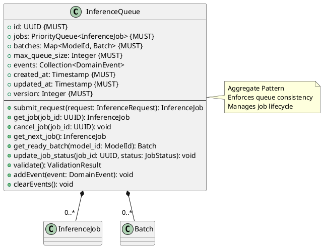

# Inference Queue Aggregate

**Context:** Inference
**Type:** Aggregate Root
**Version:** 1.0.0
**Date:** 2025-12-04

---

## 1. Overview

The `InferenceQueue` aggregate manages the lifecycle of inference jobs, including queuing, prioritization, batching, and execution coordination.

---

## 2. Structure



---

## 3. Field Specifications

### 3.1 id

- **Type:** UUID
- **Constraint:** MUST
- **Description:** Unique queue identifier

### 3.2 jobs

- **Type:** PriorityQueue\<InferenceJob>
- **Constraint:** MUST
- **Description:** Jobs prioritized by request priority

### 3.3 batches

- **Type:** Map<ModelId, Batch>
- **Constraint:** MUST
- **Description:** Active batches per model

### 3.4 max_queue_size

- **Type:** Integer
- **Constraint:** MUST
- **Default:** 1000
- **Description:** Maximum jobs in queue

### 3.5 events

- **Type:** Collection\<DomainEvent>
- **Description:** Domain events

---

## 4. Behavior

### 4.1 Request Submission

```python
def submit_request(self, request: InferenceRequest) -> InferenceJob:
    """Submit inference request and create job"""
    # Check queue capacity
    if len(self.jobs) >= self.max_queue_size:
        raise QueueFullError("Queue at capacity")

    # Create job
    job = InferenceJob(
        id=generate_uuid(),
        request=request,
        status=JobStatus(status=JobStatusEnum.PENDING),
        created_at=now(),
        updated_at=now(),
        version=1
    )

    # Add to priority queue
    self.jobs.put((job.request.priority.score, job))

    # Update job status
    job.update_status(JobStatus(status=JobStatusEnum.QUEUED))

    self.updated_at = now()
    self.version += 1

    # Generate event
    self.addEvent(JobSubmittedEvent(
        queue_id=self.id,
        job_id=job.id,
        timestamp=now()
    ))

    return job
```

### 4.2 Job Retrieval

```python
def get_next_job(self) -> InferenceJob:
    """Get highest priority job from queue"""
    if self.jobs.empty():
        return None

    _, job = self.jobs.get()
    job.update_status(JobStatus(status=JobStatusEnum.PROCESSING))

    return job
```

### 4.3 Batch Management

```python
def get_ready_batch(self, model_id: ModelId) -> Batch:
    """Get or create batch for model"""
    # Get existing batch
    if model_id in self.batches:
        batch = self.batches[model_id]
        if batch.is_ready():
            del self.batches[model_id]
            return batch
        return None

    # Create new batch
    batch = Batch(
        id=generate_uuid(),
        model_id=model_id,
        requests=[],
        max_batch_size=32,
        max_wait_ms=100,
        created_at=now(),
        updated_at=now(),
        version=1
    )

    self.batches[model_id] = batch
    return None
```

### 4.4 Job Cancellation

```python
def cancel_job(self, job_id: UUID) -> void:
    """Cancel a pending or queued job"""
    job = self.get_job(job_id)

    if not job.status.can_cancel():
        raise InvalidOperationError("Job cannot be cancelled")

    job.update_status(JobStatus(status=JobStatusEnum.CANCELLED))

    self.updated_at = now()
    self.version += 1

    # Generate event
    self.addEvent(JobCancelledEvent(
        queue_id=self.id,
        job_id=job_id,
        timestamp=now()
    ))
```

---

## 5. Domain Events

### 5.1 JobSubmittedEvent

```python
class JobSubmittedEvent:
    queue_id: UUID
    job_id: UUID
    model_id: ModelId
    priority: Priority
    timestamp: Timestamp
```

### 5.2 JobCompletedEvent

```python
class JobCompletedEvent:
    queue_id: UUID
    job_id: UUID
    processing_time_ms: Float
    timestamp: Timestamp
```

### 5.3 JobCancelledEvent

```python
class JobCancelledEvent:
    queue_id: UUID
    job_id: UUID
    timestamp: Timestamp
```

---

## 6. Serialization

```json
{
  "id": "11000000-e29b-41d4-a716-446655440013",
  "max_queue_size": 1000,
  "jobs": [
    {
      "id": "ee0e8400-e29b-41d4-a716-446655440010",
      "status": "queued"
    }
  ],
  "batches": {
    "sentence-transformers/all-MiniLM-L6-v2": {
      "id": "ff0e8400-e29b-41d4-a716-446655440011",
      "size": 5
    }
  },
  "created_at": "2025-12-04T10:00:00Z",
  "updated_at": "2025-12-04T10:30:15Z",
  "version": 42
}
```

---

## 7. Database Schema

```sql
CREATE TABLE inference_queue (
    id UUID PRIMARY KEY,
    max_queue_size INTEGER NOT NULL DEFAULT 1000,
    created_at TIMESTAMP NOT NULL DEFAULT NOW(),
    updated_at TIMESTAMP NOT NULL DEFAULT NOW(),
    version_number INTEGER NOT NULL DEFAULT 1
);

-- inference_job and batch tables reference queue
ALTER TABLE inference_job ADD COLUMN queue_id UUID REFERENCES inference_queue(id);
ALTER TABLE batch ADD COLUMN queue_id UUID REFERENCES inference_queue(id);

CREATE TRIGGER update_inference_queue_timestamp
BEFORE UPDATE ON inference_queue
FOR EACH ROW
EXECUTE FUNCTION update_timestamp_and_version();
```

---

## 8. Usage Examples

### 8.1 Submitting Request

```python
# Submit request
request = InferenceRequest(...)
job = queue.submit_request(request)

# Poll for result
while not job.is_complete():
    time.sleep(0.1)
    job = queue.get_job(job.id)

result = job.result
```

### 8.2 Processing Loop

```python
while True:
    # Get next job
    job = queue.get_next_job()
    if not job:
        time.sleep(0.1)
        continue

    try:
        # Process
        result = model.infer(job.request.input_data)
        job.set_result(result)
    except Exception as e:
        job.set_error(str(e))

    # Publish events
    for event in queue.events:
        event_bus.publish(event)
    queue.clearEvents()
```

---

## 9. Related Models

- [Inference Job](./inference_job.md) - Managed by queue
- [Inference Request](./inference_request.md) - Job input
- [Batch](./batch.md) - Batching optimization
- [Job Status](./job_status.md) - Job state
- [Priority](./priority.md) - Queue ordering
