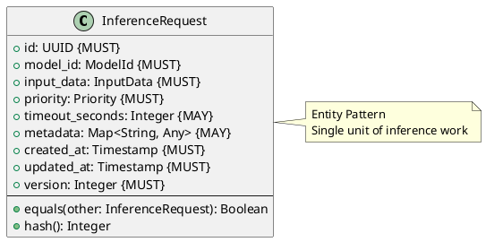

# Inference Request Entity

**Context:** Inference
**Type:** Entity
**Version:** 1.0.0
**Date:** 2025-12-04

---

## 1. Overview

The `InferenceRequest` entity represents a single inference request with input data, target model, and priority.

---

## 2. Structure



---

## 3. Field Specifications

### 3.1 id

- **Type:** UUID
- **Constraint:** MUST
- **Description:** Unique request identifier

### 3.2 model_id

- **Type:** ModelId
- **Constraint:** MUST
- **Description:** Target model for inference

### 3.3 input_data

- **Type:** InputData
- **Constraint:** MUST
- **Description:** Task-specific input

### 3.4 priority

- **Type:** Priority
- **Constraint:** MUST
- **Default:** MEDIUM
- **Description:** Request priority level

### 3.5 timeout_seconds

- **Type:** Integer
- **Constraint:** MAY
- **Default:** 60
- **Description:** Maximum processing time

### 3.6 metadata

- **Type:** Map<String, Any>
- **Constraint:** MAY
- **Description:** User-defined metadata (tracing, correlation IDs)

---

## 4. Serialization

```json
{
  "id": "dd0e8400-e29b-41d4-a716-446655440009",
  "model_id": "sentence-transformers/all-MiniLM-L6-v2",
  "input_data": {
    "task_type": "txt2embed",
    "text": "Hello world"
  },
  "priority": "high",
  "timeout_seconds": 60,
  "metadata": {
    "user_id": "user123",
    "trace_id": "abc-def-ghi"
  },
  "created_at": "2025-12-04T10:30:00Z",
  "updated_at": "2025-12-04T10:30:00Z",
  "version": 1
}
```

---

## 5. Database Schema

```sql
CREATE TABLE inference_request (
    id UUID PRIMARY KEY,
    model_id VARCHAR(255) NOT NULL,
    input_data JSONB NOT NULL,
    priority priority_enum NOT NULL DEFAULT 'medium',
    timeout_seconds INTEGER DEFAULT 60,
    metadata JSONB,
    created_at TIMESTAMP NOT NULL DEFAULT NOW(),
    updated_at TIMESTAMP NOT NULL DEFAULT NOW(),
    version_number INTEGER NOT NULL DEFAULT 1
);

CREATE INDEX idx_inference_request_model_id ON inference_request(model_id);
CREATE INDEX idx_inference_request_priority ON inference_request(priority);
```

---

## 6. Related Models

- [Inference Job](./inference_job.md) - Wraps InferenceRequest with status
- [Batch](./batch.md) - Groups multiple requests
- [Input Data](./input_data.md) - Request input
