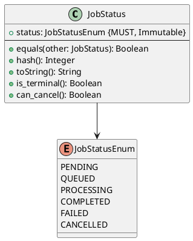

# Job Status Value Object

**Context:** Inference
**Type:** Value Object
**Version:** 1.0.0
**Date:** 2025-12-04

---

## 1. Overview

The `JobStatus` value object represents the current state of an inference job in the processing pipeline.

---

## 2. Structure



---

## 3. Status Enumeration

| Status | Description | Terminal | Cancellable |
|--------|-------------|----------|-------------|
| `PENDING` | Job created, awaiting queue | No | Yes |
| `QUEUED` | In queue, waiting for processing | No | Yes |
| `PROCESSING` | Currently being processed | No | No |
| `COMPLETED` | Successfully completed | Yes | No |
| `FAILED` | Processing failed | Yes | No |
| `CANCELLED` | Cancelled by user | Yes | No |

---

## 4. Behavior

```python
def is_terminal(self) -> bool:
    """Check if status is final"""
    return self.status in [
        JobStatusEnum.COMPLETED,
        JobStatusEnum.FAILED,
        JobStatusEnum.CANCELLED
    ]

def can_cancel(self) -> bool:
    """Check if job can be cancelled"""
    return self.status in [
        JobStatusEnum.PENDING,
        JobStatusEnum.QUEUED
    ]
```

---

## 5. Serialization

```json
{
  "status": "processing"
}
```

```protobuf
enum JobStatus {
  JOB_STATUS_UNSPECIFIED = 0;
  JOB_STATUS_PENDING = 1;
  JOB_STATUS_QUEUED = 2;
  JOB_STATUS_PROCESSING = 3;
  JOB_STATUS_COMPLETED = 4;
  JOB_STATUS_FAILED = 5;
  JOB_STATUS_CANCELLED = 6;
}
```

---

## 6. Related Models

- [Inference Job](./inference_job.md) - Uses JobStatus
- [Inference Queue](./inference_queue.md) - Manages jobs by status
