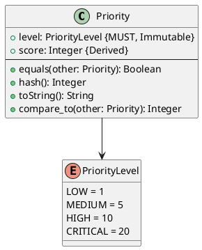

# Priority Value Object

**Context:** Inference
**Type:** Value Object
**Version:** 1.0.0
**Date:** 2025-12-04

---

## 1. Overview

The `Priority` value object defines the urgency level of inference requests for queue prioritization.

---

## 2. Structure



---

## 3. Priority Levels

| Level | Score | Use Case |
|-------|-------|----------|
| `LOW` | 1 | Batch processing, background tasks |
| `MEDIUM` | 5 | Standard API requests |
| `HIGH` | 10 | Interactive user requests |
| `CRITICAL` | 20 | Real-time, time-sensitive operations |

---

## 4. Behavior

```python
@property
def score(self) -> int:
    """Get numeric priority score for sorting"""
    return self.level.value

def compare_to(self, other: Priority) -> int:
    """Compare priorities (for sorting)"""
    return self.score - other.score
```

---

## 5. Serialization

```json
{
  "priority": "high"
}
```

```protobuf
enum Priority {
  PRIORITY_UNSPECIFIED = 0;
  PRIORITY_LOW = 1;
  PRIORITY_MEDIUM = 5;
  PRIORITY_HIGH = 10;
  PRIORITY_CRITICAL = 20;
}
```

---

## 6. Usage Example

```python
# Priority queue sorting
jobs.sort(key=lambda j: -j.request.priority.score)  # High to low
```

---

## 7. Related Models

- [Inference Request](./inference_request.md) - Includes Priority
- [Inference Queue](./inference_queue.md) - Uses Priority for ordering
