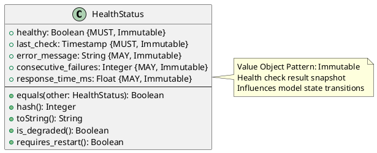

# Health Status Value Object

**Context:** Lifecycle
**Type:** Value Object
**Version:** 1.0.0
**Date:** 2025-12-04

---

## 1. Overview

The `HealthStatus` value object represents the health state of a loaded model, including readiness for inference and diagnostic information.

---

## 2. Structure

### 2.1 PlantUML Diagram



---

## 3. Field Specifications

### 3.1 healthy

- **Type:** Boolean
- **Constraint:** MUST, Immutable
- **Description:** Overall health status
- **Validation:**
  - `true`: Model operational and passing health checks
  - `false`: Model failing health checks

### 3.2 last_check

- **Type:** Timestamp
- **Constraint:** MUST, Immutable
- **Description:** When health check was performed
- **Validation:**
  - MUST be valid ISO 8601 timestamp

### 3.3 error_message

- **Type:** String
- **Constraint:** MAY, Immutable
- **Description:** Error details if unhealthy
- **Validation:**
  - Length: 0-1000 characters
  - Should be present when `healthy = false`

### 3.4 consecutive_failures

- **Type:** Integer
- **Constraint:** MAY, Immutable
- **Description:** Number of consecutive failed health checks
- **Validation:**
  - MUST be >= 0
  - Used to trigger automatic restarts

### 3.5 response_time_ms

- **Type:** Float
- **Constraint:** MAY, Immutable
- **Description:** Health check response time in milliseconds
- **Validation:**
  - MUST be >= 0
  - Used to detect performance degradation

---

## 4. Constraints

### 4.1 Value Object Constraints

- All fields MUST be immutable after creation
- Equality based on structural comparison
- No identity field required

### 4.2 Business Rules

- If `healthy = false`, `error_message` SHOULD be present
- `consecutive_failures` resets to 0 when `healthy = true`
- High `response_time_ms` may indicate degraded performance
- Exceeding failure threshold triggers state transition to UNHEALTHY

---

## 5. Validation

### 5.1 Syntax Validation

```python
def validate_syntax(status: HealthStatus) -> ValidationResult:
    errors = []

    if status.healthy is None:
        errors.append("healthy is required")

    if not status.last_check:
        errors.append("last_check is required")

    if status.consecutive_failures is not None and status.consecutive_failures < 0:
        errors.append("consecutive_failures must be >= 0")

    if status.response_time_ms is not None and status.response_time_ms < 0:
        errors.append("response_time_ms must be >= 0")

    return ValidationResult(valid=len(errors) == 0, errors=errors)
```

### 5.2 Semantic Validation

```python
def validate_semantic(status: HealthStatus) -> ValidationResult:
    warnings = []

    # Unhealthy without error message
    if not status.healthy and not status.error_message:
        warnings.append("Unhealthy status should include error_message")

    # High consecutive failures
    if status.consecutive_failures and status.consecutive_failures > 3:
        warnings.append(
            f"High consecutive failures: {status.consecutive_failures}"
        )

    # Slow response time
    if status.response_time_ms and status.response_time_ms > 5000:
        warnings.append(
            f"Slow health check response: {status.response_time_ms}ms"
        )

    return ValidationResult(valid=True, warnings=warnings)
```

---

## 6. Behavior

### 6.1 Creation

```python
def create_healthy_status(response_time_ms: float = None) -> HealthStatus:
    """Create a healthy status"""
    return HealthStatus(
        healthy=True,
        last_check=current_timestamp(),
        error_message=None,
        consecutive_failures=0,
        response_time_ms=response_time_ms
    )

def create_unhealthy_status(
    error_message: str,
    consecutive_failures: int = 1,
    response_time_ms: float = None
) -> HealthStatus:
    """Create an unhealthy status"""
    return HealthStatus(
        healthy=False,
        last_check=current_timestamp(),
        error_message=error_message,
        consecutive_failures=consecutive_failures,
        response_time_ms=response_time_ms
    )
```

### 6.2 Status Queries

```python
def is_degraded(self) -> bool:
    """Check if performance is degraded but still operational"""
    if not self.healthy:
        return False

    # Slow response time indicates degradation
    if self.response_time_ms and self.response_time_ms > 3000:
        return True

    return False

def requires_restart(self) -> bool:
    """Check if model should be restarted"""
    # Too many consecutive failures
    if self.consecutive_failures and self.consecutive_failures >= 5:
        return True

    return False

def is_stale(self, max_age_seconds: int = 60) -> bool:
    """Check if health check is stale"""
    age_seconds = (current_timestamp() - self.last_check).total_seconds()
    return age_seconds > max_age_seconds
```

### 6.3 Value Object Methods

```python
def equals(self, other: HealthStatus) -> bool:
    """Structural equality"""
    return (
        self.healthy == other.healthy and
        self.last_check == other.last_check
    )

def hash(self) -> int:
    """Hash based on values"""
    return hash((self.healthy, self.last_check))

def toString(self) -> str:
    """Human-readable representation"""
    status_str = "healthy" if self.healthy else "unhealthy"
    details = ""

    if not self.healthy and self.error_message:
        details = f" ({self.error_message})"
    elif self.consecutive_failures and self.consecutive_failures > 0:
        details = f" ({self.consecutive_failures} failures)"

    return f"{status_str}{details}"
```

---

## 7. Serialization

### 7.1 JSON Example

```json
{
  "healthy": true,
  "last_check": "2025-12-04T10:30:15Z",
  "consecutive_failures": 0,
  "response_time_ms": 45.3
}
```

```json
{
  "healthy": false,
  "last_check": "2025-12-04T10:30:15Z",
  "error_message": "Model inference timeout after 30s",
  "consecutive_failures": 3,
  "response_time_ms": 30000.0
}
```

### 7.2 Protocol Buffers

```protobuf
message HealthStatus {
  bool healthy = 1;
  google.protobuf.Timestamp last_check = 2;
  string error_message = 3;
  int32 consecutive_failures = 4;
  float response_time_ms = 5;
}
```

---

## 8. Database Schema

```sql
-- Embedded in loaded_model table as JSONB
CREATE TABLE loaded_model (
    ...
    health_status JSONB NOT NULL,
    ...
);

-- Or separate table for history
CREATE TABLE health_check_history (
    loaded_model_id UUID NOT NULL REFERENCES loaded_model(id) ON DELETE CASCADE,
    healthy BOOLEAN NOT NULL,
    last_check TIMESTAMP NOT NULL DEFAULT NOW(),
    error_message TEXT,
    consecutive_failures INTEGER DEFAULT 0,
    response_time_ms REAL,
    PRIMARY KEY (loaded_model_id, last_check)
);

CREATE INDEX idx_health_check_timestamp ON health_check_history(last_check);
CREATE INDEX idx_health_check_model ON health_check_history(loaded_model_id);
CREATE INDEX idx_health_check_status ON health_check_history(healthy);
```

---

## 9. Usage Examples

### 9.1 Performing Health Check

```python
def perform_health_check(model) -> HealthStatus:
    """Execute health check on loaded model"""
    start_time = time.time()

    try:
        # Simple inference test
        result = model.inference(test_input)
        response_time_ms = (time.time() - start_time) * 1000

        if result is None:
            return create_unhealthy_status(
                error_message="Model returned None",
                response_time_ms=response_time_ms
            )

        return create_healthy_status(response_time_ms=response_time_ms)

    except TimeoutError as e:
        response_time_ms = (time.time() - start_time) * 1000
        return create_unhealthy_status(
            error_message=f"Inference timeout: {str(e)}",
            response_time_ms=response_time_ms
        )
    except Exception as e:
        response_time_ms = (time.time() - start_time) * 1000
        return create_unhealthy_status(
            error_message=f"Inference failed: {str(e)}",
            response_time_ms=response_time_ms
        )
```

### 9.2 Health Monitoring Loop

```python
def monitor_model_health(loaded_model, check_interval_seconds: int = 30):
    """Continuously monitor model health"""
    previous_status = loaded_model.health_status

    while loaded_model.state.is_operational():
        # Perform health check
        current_status = perform_health_check(loaded_model)

        # Update consecutive failures
        if not current_status.healthy:
            failures = (previous_status.consecutive_failures or 0) + 1
            current_status = HealthStatus(
                healthy=current_status.healthy,
                last_check=current_status.last_check,
                error_message=current_status.error_message,
                consecutive_failures=failures,
                response_time_ms=current_status.response_time_ms
            )

        # Update model health status
        loaded_model.health_status = current_status

        # Check if restart needed
        if current_status.requires_restart():
            logger.error(f"Model {loaded_model.model_id} requires restart")
            restart_model(loaded_model)

        previous_status = current_status
        time.sleep(check_interval_seconds)
```

### 9.3 State Transition Integration

```python
def update_model_state_from_health(loaded_model):
    """Update model state based on health status"""
    status = loaded_model.health_status

    if loaded_model.state == ModelState.LOADED:
        if not status.healthy and status.consecutive_failures >= 3:
            # Transition to UNHEALTHY
            loaded_model.state = ModelState(state=ModelStateEnum.UNHEALTHY)
            logger.warning(
                f"Model {loaded_model.model_id} transitioned to UNHEALTHY"
            )

    elif loaded_model.state == ModelState.UNHEALTHY:
        if status.healthy and status.consecutive_failures == 0:
            # Recovery: transition back to LOADED
            loaded_model.state = ModelState(state=ModelStateEnum.LOADED)
            logger.info(
                f"Model {loaded_model.model_id} recovered to LOADED"
            )
```

### 9.4 Health Dashboard

```python
def get_health_summary(lifecycle_manager):
    """Get overall health summary of all loaded models"""
    healthy_count = 0
    unhealthy_count = 0
    degraded_count = 0

    for model in lifecycle_manager.loaded_models.values():
        status = model.health_status

        if status.healthy:
            if status.is_degraded():
                degraded_count += 1
            else:
                healthy_count += 1
        else:
            unhealthy_count += 1

    return {
        "healthy": healthy_count,
        "degraded": degraded_count,
        "unhealthy": unhealthy_count,
        "total": len(lifecycle_manager.loaded_models)
    }
```

---

## 10. Related Models

- [Loaded Model](./loaded_model.md) - Contains HealthStatus
- [Model State](./model_state.md) - Influenced by HealthStatus (healthy ↔ unhealthy)
- [Model Lifecycle Manager](./model_lifecycle_manager.md) - Monitors health and manages transitions
