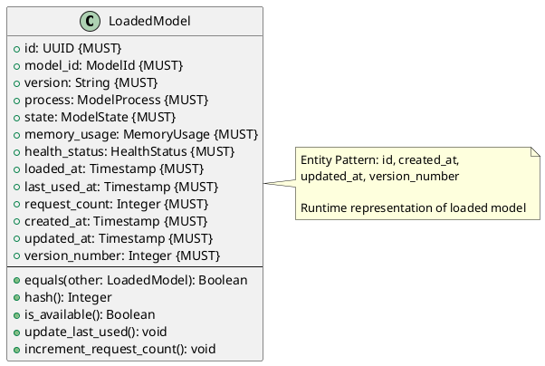
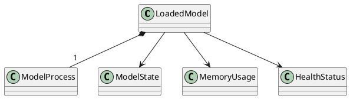

# Loaded Model Entity

**Context:** Lifecycle
**Type:** Entity
**Version:** 1.0.0
**Date:** 2025-12-04

---

## 1. Overview

The `LoadedModel` entity represents a model loaded into memory, tracking its runtime state, process, resource usage, and health.

---

## 2. Structure

### 2.1 PlantUML Diagram



### 2.2 Relationships



---

## 3. Field Specifications

### 3.1 id

- **Type:** UUID
- **Constraint:** MUST
- **Description:** Unique identifier

### 3.2 model_id

- **Type:** ModelId
- **Constraint:** MUST
- **Description:** Reference to registered model

### 3.3 version

- **Type:** String
- **Constraint:** MUST
- **Description:** Loaded model version

### 3.4 process

- **Type:** ModelProcess
- **Constraint:** MUST
- **Description:** OS process running the model

### 3.5 state

- **Type:** ModelState
- **Constraint:** MUST
- **Description:** Current lifecycle state

### 3.6 memory_usage

- **Type:** MemoryUsage
- **Constraint:** MUST
- **Description:** Current memory consumption

### 3.7 health_status

- **Type:** HealthStatus
- **Constraint:** MUST
- **Description:** Health check results

### 3.8 loaded_at

- **Type:** Timestamp
- **Constraint:** MUST
- **Description:** When model was loaded

### 3.9 last_used_at

- **Type:** Timestamp
- **Constraint:** MUST
- **Description:** Last inference request time (LRU tracking)

### 3.10 request_count

- **Type:** Integer
- **Constraint:** MUST
- **Description:** Total inference requests served

---

## 4. Behavior

### 4.1 Availability Check

```python
def is_available(self) -> bool:
    """Check if model can accept requests"""
    return (
        self.state.is_operational() and
        self.health_status.healthy and
        self.process.is_running()
    )
```

### 4.2 Usage Tracking

```python
def update_last_used(self) -> None:
    """Update last used timestamp for LRU"""
    self.last_used_at = current_timestamp()
    self.updated_at = current_timestamp()
    self.version_number += 1

def increment_request_count(self) -> None:
    """Increment request counter"""
    self.request_count += 1
    self.updated_at = current_timestamp()
    self.version_number += 1
```

---

## 5. Serialization

### 5.1 JSON Example

```json
{
  "id": "bb0e8400-e29b-41d4-a716-446655440007",
  "model_id": "sentence-transformers/all-MiniLM-L6-v2",
  "version": "v2.2.2",
  "process": {
    "id": "aa0e8400-e29b-41d4-a716-446655440006",
    "process_id": 12345
  },
  "state": {
    "state": "loaded"
  },
  "memory_usage": {
    "used_mb": 512.5,
    "peak_mb": 550.0,
    "timestamp": "2025-12-04T10:30:15Z"
  },
  "health_status": {
    "healthy": true,
    "last_check": "2025-12-04T10:30:15Z"
  },
  "loaded_at": "2025-12-04T10:25:00Z",
  "last_used_at": "2025-12-04T10:30:00Z",
  "request_count": 42,
  "created_at": "2025-12-04T10:25:00Z",
  "updated_at": "2025-12-04T10:30:15Z",
  "version": 5
}
```

---

## 6. Database Schema

```sql
CREATE TABLE loaded_model (
    id UUID PRIMARY KEY,
    model_id VARCHAR(255) NOT NULL,
    version VARCHAR(100) NOT NULL,
    process_id UUID NOT NULL REFERENCES model_process(id) ON DELETE CASCADE,
    state model_state_enum NOT NULL DEFAULT 'unloaded',
    memory_usage JSONB NOT NULL,
    health_status JSONB NOT NULL,
    loaded_at TIMESTAMP NOT NULL,
    last_used_at TIMESTAMP NOT NULL,
    request_count INTEGER NOT NULL DEFAULT 0,
    created_at TIMESTAMP NOT NULL DEFAULT NOW(),
    updated_at TIMESTAMP NOT NULL DEFAULT NOW(),
    version_number INTEGER NOT NULL DEFAULT 1,
    UNIQUE (model_id, version)
);

CREATE INDEX idx_loaded_model_model_id ON loaded_model(model_id);
CREATE INDEX idx_loaded_model_state ON loaded_model(state);
CREATE INDEX idx_loaded_model_last_used ON loaded_model(last_used_at);

CREATE TRIGGER update_loaded_model_timestamp
BEFORE UPDATE ON loaded_model
FOR EACH ROW
EXECUTE FUNCTION update_timestamp_and_version();
```

---

## 7. Usage Examples

### 7.1 Loading Model

```python
def load_model(model_id: ModelId, version: str) -> LoadedModel:
    """Load model into memory"""
    # Start process
    process = start_model_process(model_id, {})

    # Create loaded model
    loaded_model = LoadedModel(
        id=generate_uuid(),
        model_id=model_id,
        version=version,
        process=process,
        state=ModelState(state=ModelStateEnum.LOADING),
        memory_usage=MemoryUsage(used_mb=0, peak_mb=0, timestamp=now()),
        health_status=create_healthy_status(),
        loaded_at=now(),
        last_used_at=now(),
        request_count=0,
        created_at=now(),
        updated_at=now(),
        version_number=1
    )

    # Complete loading
    loaded_model.state = ModelState(state=ModelStateEnum.LOADED)
    return loaded_model
```

### 7.2 LRU Eviction

```python
def get_lru_model(loaded_models: List[LoadedModel]) -> LoadedModel:
    """Find least recently used model for eviction"""
    return min(loaded_models, key=lambda m: m.last_used_at)
```

---

## 8. Related Models

- [Model Process](./model_process.md) - Process running the model
- [Model State](./model_state.md) - Lifecycle state
- [Memory Usage](./memory_usage.md) - Resource consumption
- [Health Status](./health_status.md) - Health check results
- [Model Lifecycle Manager](./model_lifecycle_manager.md) - Manages loaded models
