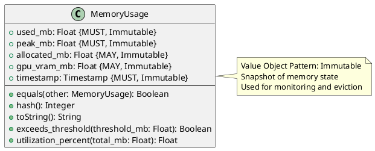

# Memory Usage Value Object

**Context:** Lifecycle
**Type:** Value Object
**Version:** 1.0.0
**Date:** 2025-12-04

---

## 1. Overview

The `MemoryUsage` value object tracks memory consumption of a loaded model, including current usage, peak usage, and allocation metrics.

---

## 2. Structure

### 2.1 PlantUML Diagram



---

## 3. Field Specifications

### 3.1 used_mb

- **Type:** Float
- **Constraint:** MUST, Immutable
- **Description:** Current memory usage in megabytes
- **Validation:**
  - MUST be >= 0
  - Includes model weights and runtime buffers

### 3.2 peak_mb

- **Type:** Float
- **Constraint:** MUST, Immutable
- **Description:** Peak memory usage since model loaded
- **Validation:**
  - MUST be >= used_mb
  - Tracks maximum memory footprint

### 3.3 allocated_mb

- **Type:** Float
- **Constraint:** MAY, Immutable
- **Description:** Memory allocated (vs. actually used)
- **Validation:**
  - MUST be >= used_mb if specified
  - May be higher due to pre-allocation

### 3.4 gpu_vram_mb

- **Type:** Float
- **Constraint:** MAY, Immutable
- **Description:** GPU VRAM usage in megabytes
- **Validation:**
  - MUST be >= 0 if specified
  - 0 or null for CPU-only models

### 3.5 timestamp

- **Type:** Timestamp
- **Constraint:** MUST, Immutable
- **Description:** When measurement was taken
- **Validation:**
  - MUST be valid ISO 8601 timestamp
  - Used for time-series analysis

---

## 4. Constraints

### 4.1 Value Object Constraints

- All fields MUST be immutable after creation
- Equality based on structural comparison
- No identity field required

### 4.2 Business Rules

- `peak_mb` >= `used_mb` (peak is always maximum)
- `allocated_mb` >= `used_mb` if specified
- `gpu_vram_mb` should align with GPU model requirements
- New measurements should have increasing timestamps

---

## 5. Validation

### 5.1 Syntax Validation

```python
def validate_syntax(usage: MemoryUsage) -> ValidationResult:
    errors = []

    if usage.used_mb is None:
        errors.append("used_mb is required")
    elif usage.used_mb < 0:
        errors.append("used_mb must be >= 0")

    if usage.peak_mb is None:
        errors.append("peak_mb is required")
    elif usage.peak_mb < 0:
        errors.append("peak_mb must be >= 0")
    elif usage.peak_mb < usage.used_mb:
        errors.append("peak_mb must be >= used_mb")

    if usage.allocated_mb is not None:
        if usage.allocated_mb < 0:
            errors.append("allocated_mb must be >= 0")
        elif usage.allocated_mb < usage.used_mb:
            errors.append("allocated_mb must be >= used_mb")

    if usage.gpu_vram_mb is not None and usage.gpu_vram_mb < 0:
        errors.append("gpu_vram_mb must be >= 0")

    if not usage.timestamp:
        errors.append("timestamp is required")

    return ValidationResult(valid=len(errors) == 0, errors=errors)
```

---

## 6. Behavior

### 6.1 Creation

```python
def create_memory_usage(
    used_mb: float,
    peak_mb: float,
    allocated_mb: float = None,
    gpu_vram_mb: float = None
) -> MemoryUsage:
    """Create memory usage snapshot"""
    return MemoryUsage(
        used_mb=used_mb,
        peak_mb=max(peak_mb, used_mb),  # Ensure peak >= used
        allocated_mb=allocated_mb,
        gpu_vram_mb=gpu_vram_mb,
        timestamp=current_timestamp()
    )
```

### 6.2 Metric Calculations

```python
def exceeds_threshold(self, threshold_mb: float) -> bool:
    """Check if usage exceeds threshold"""
    return self.used_mb > threshold_mb

def utilization_percent(self, total_mb: float) -> float:
    """Calculate memory utilization percentage"""
    if total_mb <= 0:
        return 0.0
    return (self.used_mb / total_mb) * 100.0

def fragmentation_percent(self) -> float:
    """Calculate memory fragmentation (allocated vs. used)"""
    if self.allocated_mb is None or self.allocated_mb == 0:
        return 0.0
    return ((self.allocated_mb - self.used_mb) / self.allocated_mb) * 100.0
```

### 6.3 Value Object Methods

```python
def equals(self, other: MemoryUsage) -> bool:
    """Structural equality (comparing snapshots)"""
    return (
        abs(self.used_mb - other.used_mb) < 0.01 and
        abs(self.peak_mb - other.peak_mb) < 0.01 and
        self.timestamp == other.timestamp
    )

def hash(self) -> int:
    """Hash based on values"""
    return hash((
        round(self.used_mb, 2),
        round(self.peak_mb, 2),
        self.timestamp
    ))

def toString(self) -> str:
    """Human-readable representation"""
    gpu_info = f", GPU: {self.gpu_vram_mb:.1f}MB" if self.gpu_vram_mb else ""
    return f"Memory: {self.used_mb:.1f}MB / {self.peak_mb:.1f}MB peak{gpu_info}"
```

---

## 7. Serialization

### 7.1 JSON Example

```json
{
  "used_mb": 2048.5,
  "peak_mb": 2150.3,
  "allocated_mb": 2200.0,
  "gpu_vram_mb": 0.0,
  "timestamp": "2025-12-04T10:30:15Z"
}
```

```json
{
  "used_mb": 15360.2,
  "peak_mb": 15890.7,
  "allocated_mb": 16384.0,
  "gpu_vram_mb": 15360.2,
  "timestamp": "2025-12-04T10:30:15Z"
}
```

### 7.2 Protocol Buffers

```protobuf
message MemoryUsage {
  float used_mb = 1;
  float peak_mb = 2;
  float allocated_mb = 3;
  float gpu_vram_mb = 4;
  google.protobuf.Timestamp timestamp = 5;
}
```

---

## 8. Database Schema

```sql
-- Stored as JSONB in loaded_model table or separate metrics table
CREATE TABLE memory_usage_history (
    loaded_model_id UUID NOT NULL REFERENCES loaded_model(id) ON DELETE CASCADE,
    used_mb REAL NOT NULL CHECK (used_mb >= 0),
    peak_mb REAL NOT NULL CHECK (peak_mb >= used_mb),
    allocated_mb REAL CHECK (allocated_mb >= used_mb),
    gpu_vram_mb REAL CHECK (gpu_vram_mb >= 0),
    timestamp TIMESTAMP NOT NULL DEFAULT NOW(),
    PRIMARY KEY (loaded_model_id, timestamp)
);

CREATE INDEX idx_memory_usage_timestamp ON memory_usage_history(timestamp);
CREATE INDEX idx_memory_usage_model ON memory_usage_history(loaded_model_id);
```

---

## 9. Usage Examples

### 9.1 Measuring Memory

```python
import psutil

def measure_model_memory(model_process_id: int) -> MemoryUsage:
    """Measure current memory usage of model process"""
    process = psutil.Process(model_process_id)
    mem_info = process.memory_info()

    used_mb = mem_info.rss / (1024 * 1024)  # Convert to MB

    # Track peak from previous measurements
    peak_mb = max(used_mb, get_previous_peak(model_process_id))

    return MemoryUsage(
        used_mb=used_mb,
        peak_mb=peak_mb,
        timestamp=current_timestamp()
    )
```

### 9.2 Eviction Decision

```python
def should_evict_model(
    usage: MemoryUsage,
    system_capacity_mb: float,
    eviction_threshold: float = 0.85
) -> bool:
    """Determine if model should be evicted based on memory usage"""
    utilization = usage.utilization_percent(system_capacity_mb)
    return utilization > (eviction_threshold * 100)

# Example
usage = MemoryUsage(used_mb=7200, peak_mb=7500, timestamp=now())
if should_evict_model(usage, system_capacity_mb=8192):
    evict_lru_model()
```

### 9.3 Time-Series Monitoring

```python
def track_memory_over_time(model_id: str, duration_seconds: int):
    """Track memory usage over time for analysis"""
    measurements = []

    for _ in range(duration_seconds):
        usage = measure_model_memory(model_id)
        measurements.append(usage)
        time.sleep(1)

    # Analyze trend
    avg_usage = sum(m.used_mb for m in measurements) / len(measurements)
    max_peak = max(m.peak_mb for m in measurements)

    return {
        "average_mb": avg_usage,
        "max_peak_mb": max_peak,
        "measurements": measurements
    }
```

### 9.4 Alerting

```python
def check_memory_alerts(usage: MemoryUsage, requirements: ResourceRequirements):
    """Check for memory-related alerts"""
    warnings = []

    # Usage exceeds requirements
    if usage.used_mb > requirements.memory_mb * 1.2:
        warnings.append(
            f"Memory usage ({usage.used_mb:.1f}MB) exceeds "
            f"requirements ({requirements.memory_mb}MB) by 20%"
        )

    # High fragmentation
    fragmentation = usage.fragmentation_percent()
    if fragmentation > 25:
        warnings.append(f"High memory fragmentation: {fragmentation:.1f}%")

    return warnings
```

---

## 10. Related Models

- [Loaded Model](./loaded_model.md) - Contains MemoryUsage measurements
- [Resource Requirements](../registry/resource_requirements.md) - Expected memory usage
- [Model Lifecycle Manager](./model_lifecycle_manager.md) - Monitors memory for eviction
