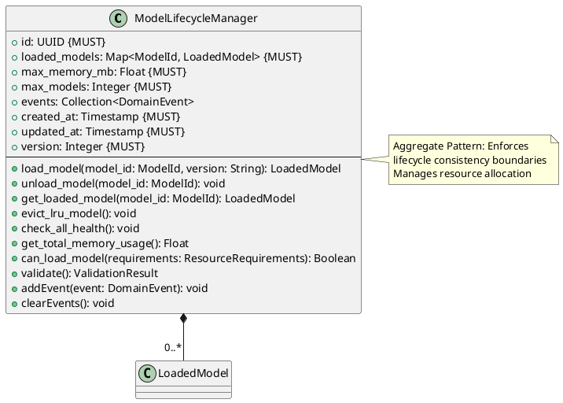

# Model Lifecycle Manager Aggregate

**Context:** Lifecycle
**Type:** Aggregate Root
**Version:** 1.0.0
**Date:** 2025-12-04

---

## 1. Overview

The `ModelLifecycleManager` aggregate coordinates model loading, unloading, health monitoring, and resource management. It enforces lifecycle invariants and manages the collection of loaded models.

---

## 2. Structure

### 2.1 PlantUML Diagram



---

## 3. Field Specifications

### 3.1 id

- **Type:** UUID
- **Constraint:** MUST
- **Description:** Unique identifier

### 3.2 loaded_models

- **Type:** Map<ModelId, LoadedModel>
- **Constraint:** MUST
- **Description:** Currently loaded models indexed by ModelId

### 3.3 max_memory_mb

- **Type:** Float
- **Constraint:** MUST
- **Description:** Maximum memory threshold for loaded models

### 3.4 max_models

- **Type:** Integer
- **Constraint:** MUST
- **Description:** Maximum number of models that can be loaded

### 3.5 events

- **Type:** Collection\<DomainEvent>
- **Description:** Domain events generated

---

## 4. Behavior

### 4.1 Model Loading

```python
def load_model(self, model_id: ModelId, version: str) -> LoadedModel:
    """Load a model into memory"""
    # Check if already loaded
    if model_id in self.loaded_models:
        return self.loaded_models[model_id]

    # Get model requirements
    model_version = registry.get_version(model_id, version)
    requirements = model_version.resource_requirements

    # Check if we can load
    if not self.can_load_model(requirements):
        # Evict LRU model
        self.evict_lru_model()

    # Load model
    loaded_model = create_loaded_model(model_id, version)
    self.loaded_models[model_id] = loaded_model

    self.updated_at = current_timestamp()
    self.version += 1

    # Generate event
    self.addEvent(ModelLoadedEvent(
        manager_id=self.id,
        model_id=model_id,
        timestamp=current_timestamp()
    ))

    return loaded_model
```

### 4.2 Model Unloading

```python
def unload_model(self, model_id: ModelId) -> None:
    """Unload a model from memory"""
    if model_id not in self.loaded_models:
        raise ValueError(f"Model {model_id} not loaded")

    loaded_model = self.loaded_models[model_id]

    # Transition to unloading
    loaded_model.state = ModelState(state=ModelStateEnum.UNLOADING)

    # Terminate process
    loaded_model.process.terminate()

    # Remove from loaded models
    del self.loaded_models[model_id]

    self.updated_at = current_timestamp()
    self.version += 1

    # Generate event
    self.addEvent(ModelUnloadedEvent(
        manager_id=self.id,
        model_id=model_id,
        timestamp=current_timestamp()
    ))
```

### 4.3 Resource Management

```python
def get_total_memory_usage(self) -> float:
    """Calculate total memory used by all loaded models"""
    return sum(m.memory_usage.used_mb for m in self.loaded_models.values())

def can_load_model(self, requirements: ResourceRequirements) -> bool:
    """Check if model can be loaded within resource limits"""
    # Check model count
    if len(self.loaded_models) >= self.max_models:
        return False

    # Check memory
    current_memory = self.get_total_memory_usage()
    if current_memory + requirements.memory_mb > self.max_memory_mb:
        return False

    return True

def evict_lru_model(self) -> None:
    """Evict least recently used model"""
    if not self.loaded_models:
        return

    lru_model = min(
        self.loaded_models.values(),
        key=lambda m: m.last_used_at
    )

    self.unload_model(lru_model.model_id)
```

### 4.4 Health Monitoring

```python
def check_all_health(self) -> None:
    """Check health of all loaded models"""
    for loaded_model in self.loaded_models.values():
        # Perform health check
        status = perform_health_check(loaded_model)
        loaded_model.health_status = status

        # Update state if needed
        if not status.healthy and status.consecutive_failures >= 3:
            loaded_model.state = ModelState(state=ModelStateEnum.UNHEALTHY)
```

---

## 5. Serialization

### 5.1 JSON Example

```json
{
  "id": "cc0e8400-e29b-41d4-a716-446655440008",
  "max_memory_mb": 16384.0,
  "max_models": 10,
  "loaded_models": {
    "sentence-transformers/all-MiniLM-L6-v2": {
      "id": "bb0e8400-e29b-41d4-a716-446655440007",
      "model_id": "sentence-transformers/all-MiniLM-L6-v2",
      "state": {
        "state": "loaded"
      }
    }
  },
  "created_at": "2025-12-04T10:00:00Z",
  "updated_at": "2025-12-04T10:30:15Z",
  "version": 5
}
```

---

## 6. Database Schema

```sql
CREATE TABLE model_lifecycle_manager (
    id UUID PRIMARY KEY,
    max_memory_mb REAL NOT NULL CHECK (max_memory_mb > 0),
    max_models INTEGER NOT NULL CHECK (max_models > 0),
    created_at TIMESTAMP NOT NULL DEFAULT NOW(),
    updated_at TIMESTAMP NOT NULL DEFAULT NOW(),
    version_number INTEGER NOT NULL DEFAULT 1
);

-- loaded_model table references manager
ALTER TABLE loaded_model ADD COLUMN manager_id UUID REFERENCES model_lifecycle_manager(id);

CREATE TRIGGER update_lifecycle_manager_timestamp
BEFORE UPDATE ON model_lifecycle_manager
FOR EACH ROW
EXECUTE FUNCTION update_timestamp_and_version();
```

---

## 7. Domain Events

### 7.1 ModelLoadedEvent

```python
class ModelLoadedEvent:
    manager_id: UUID
    model_id: ModelId
    version: String
    timestamp: Timestamp
```

### 7.2 ModelUnloadedEvent

```python
class ModelUnloadedEvent:
    manager_id: UUID
    model_id: ModelId
    timestamp: Timestamp
```

---

## 8. Usage Examples

### 8.1 Initialization

```python
manager = ModelLifecycleManager(
    id=generate_uuid(),
    loaded_models={},
    max_memory_mb=16384.0,
    max_models=10,
    events=[],
    created_at=now(),
    updated_at=now(),
    version=1
)
```

### 8.2 Loading with Auto-Eviction

```python
# Load model (auto-evicts if needed)
loaded_model = manager.load_model(
    model_id="sentence-transformers/all-MiniLM-L6-v2",
    version="v2.2.2"
)

# Check availability
if loaded_model.is_available():
    result = inference_service.infer(loaded_model, request)
```

---

## 9. Related Models

- [Loaded Model](./loaded_model.md) - Managed by aggregate
- [Model Process](./model_process.md) - Created during load
- [Model State](./model_state.md) - Tracked per model
- [Memory Usage](./memory_usage.md) - Monitored for eviction
- [Health Status](./health_status.md) - Checked periodically
