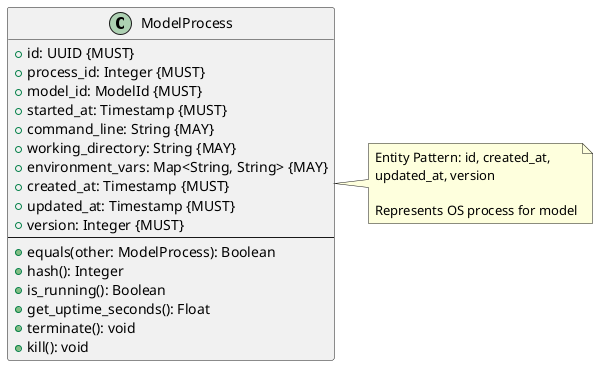

# Model Process Entity

**Context:** Lifecycle
**Type:** Entity
**Version:** 1.0.0
**Date:** 2025-12-04

---

## 1. Overview

The `ModelProcess` entity represents the operating system process running a loaded model, tracking process-level details for management and monitoring.

---

## 2. Structure

### 2.1 PlantUML Diagram



---

## 3. Field Specifications

### 3.1 id

- **Type:** UUID
- **Constraint:** MUST
- **Description:** Unique identifier for process entity

### 3.2 process_id

- **Type:** Integer
- **Constraint:** MUST
- **Description:** Operating system process ID (PID)
- **Validation:** MUST be > 0

### 3.3 model_id

- **Type:** ModelId
- **Constraint:** MUST
- **Description:** Model running in this process

### 3.4 started_at

- **Type:** Timestamp
- **Constraint:** MUST
- **Description:** When process was started

### 3.5 command_line

- **Type:** String
- **Constraint:** MAY
- **Description:** Command used to start process

### 3.6 working_directory

- **Type:** String
- **Constraint:** MAY
- **Description:** Process working directory

### 3.7 environment_vars

- **Type:** Map<String, String>
- **Constraint:** MAY
- **Description:** Environment variables for process

### 3.8 Entity Pattern Fields

- **created_at:** When entity was created
- **updated_at:** Last modification time
- **version:** Optimistic locking version

---

## 4. Constraints

### 4.1 Entity Pattern Constraints

- `id` MUST be unique
- `created_at` immutable
- `updated_at` auto-update
- `version` auto-increment

### 4.2 Business Rules

- `process_id` MUST correspond to actual OS process
- Cannot have multiple ModelProcess entities with same `process_id`
- Process MUST be running when entity created
- `started_at` <= `created_at`

---

## 5. Behavior

### 5.1 Process Management

```python
def is_running(self) -> bool:
    """Check if process is still running"""
    try:
        process = psutil.Process(self.process_id)
        return process.is_running()
    except psutil.NoSuchProcess:
        return False

def get_uptime_seconds(self) -> float:
    """Get process uptime in seconds"""
    return (current_timestamp() - self.started_at).total_seconds()

def terminate(self) -> None:
    """Gracefully terminate process"""
    try:
        process = psutil.Process(self.process_id)
        process.terminate()
    except psutil.NoSuchProcess:
        pass

def kill(self) -> None:
    """Force kill process"""
    try:
        process = psutil.Process(self.process_id)
        process.kill()
    except psutil.NoSuchProcess:
        pass
```

---

## 6. Serialization

### 6.1 JSON Example

```json
{
  "id": "aa0e8400-e29b-41d4-a716-446655440006",
  "process_id": 12345,
  "model_id": "sentence-transformers/all-MiniLM-L6-v2",
  "started_at": "2025-12-04T10:25:00Z",
  "command_line": "python model_worker.py --model sentence-transformers/all-MiniLM-L6-v2",
  "working_directory": "/opt/modelmora",
  "created_at": "2025-12-04T10:25:00Z",
  "updated_at": "2025-12-04T10:25:00Z",
  "version": 1
}
```

---

## 7. Database Schema

```sql
CREATE TABLE model_process (
    id UUID PRIMARY KEY,
    process_id INTEGER NOT NULL UNIQUE,
    model_id VARCHAR(255) NOT NULL,
    started_at TIMESTAMP NOT NULL,
    command_line TEXT,
    working_directory VARCHAR(500),
    environment_vars JSONB,
    created_at TIMESTAMP NOT NULL DEFAULT NOW(),
    updated_at TIMESTAMP NOT NULL DEFAULT NOW(),
    version_number INTEGER NOT NULL DEFAULT 1
);

CREATE INDEX idx_model_process_pid ON model_process(process_id);
CREATE INDEX idx_model_process_model_id ON model_process(model_id);

CREATE TRIGGER update_model_process_timestamp
BEFORE UPDATE ON model_process
FOR EACH ROW
EXECUTE FUNCTION update_timestamp_and_version();
```

---

## 8. Usage Examples

### 8.1 Starting Model Process

```python
def start_model_process(model_id: ModelId, config: dict) -> ModelProcess:
    """Start a new model worker process"""
    cmd = [
        "python", "model_worker.py",
        "--model", str(model_id),
        "--port", str(config["port"])
    ]

    proc = subprocess.Popen(
        cmd,
        cwd="/opt/modelmora",
        env=config.get("environment", {})
    )

    return ModelProcess(
        id=generate_uuid(),
        process_id=proc.pid,
        model_id=model_id,
        started_at=current_timestamp(),
        command_line=" ".join(cmd),
        working_directory="/opt/modelmora",
        environment_vars=config.get("environment", {}),
        created_at=current_timestamp(),
        updated_at=current_timestamp(),
        version=1
    )
```

---

## 9. Related Models

- [Loaded Model](./loaded_model.md) - Contains ModelProcess
- [Model Lifecycle Manager](./model_lifecycle_manager.md) - Manages processes
