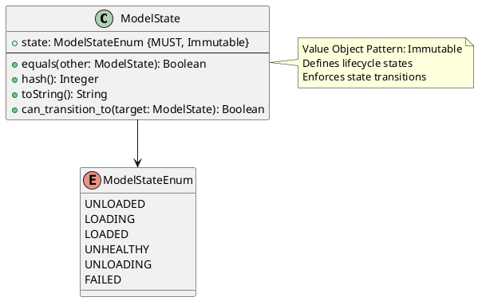
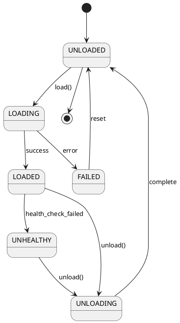

# Model State Value Object

**Context:** Lifecycle
**Type:** Value Object
**Version:** 1.0.0
**Date:** 2025-12-04

---

## 1. Overview

The `ModelState` value object represents the current state of a loaded model in its lifecycle. It defines valid states and transitions for model management.

---

## 2. Structure

### 2.1 PlantUML Diagram



### 2.2 State Transition Diagram



---

## 3. Field Specifications

### 3.1 state

- **Type:** ModelStateEnum
- **Constraint:** MUST, Immutable
- **Description:** The current lifecycle state
- **Validation:**
  - MUST be one of the defined enum values

---

## 4. State Enumeration

### 4.1 State Definitions

| State | Description | Entry Condition | Exit Actions |
|-------|-------------|----------------|--------------|
| `UNLOADED` | Model not in memory | Initial state, after unload | None |
| `LOADING` | Model being loaded | load() called | Allocate resources |
| `LOADED` | Model ready for inference | Load successful | Accept requests |
| `UNHEALTHY` | Model loaded but failing | Health check failed | Reject new requests |
| `UNLOADING` | Model being removed | unload() called | Release resources |
| `FAILED` | Load operation failed | Load error | Log error, cleanup |

### 4.2 State Behaviors

#### UNLOADED

- Model artifacts not in memory
- No resources allocated
- Can transition to: LOADING
- Cannot accept inference requests

#### LOADING

- Model artifacts being loaded into memory
- Resources being allocated
- Can transition to: LOADED, FAILED
- Cannot accept inference requests

#### LOADED

- Model fully loaded and operational
- All resources allocated
- Can transition to: UNHEALTHY, UNLOADING
- Can accept inference requests

#### UNHEALTHY

- Model loaded but failing health checks
- Resources still allocated
- Can transition to: UNLOADING, LOADED (recovery)
- Should reject new inference requests
- Existing requests may complete

#### UNLOADING

- Model being removed from memory
- Resources being released
- Can transition to: UNLOADED
- Cannot accept inference requests

#### FAILED

- Load operation encountered error
- Partial resources may be allocated
- Can transition to: UNLOADED (cleanup)
- Cannot accept inference requests

---

## 5. Constraints

### 5.1 Value Object Constraints

- `state` MUST be immutable after creation
- Equality based on `state` value (structural)
- No identity field required

### 5.2 State Transition Rules

Valid transitions:

- UNLOADED → LOADING
- LOADING → LOADED
- LOADING → FAILED
- LOADED → UNHEALTHY
- LOADED → UNLOADING
- UNHEALTHY → UNLOADING
- UNHEALTHY → LOADED (recovery)
- UNLOADING → UNLOADED
- FAILED → UNLOADED

Invalid transitions (must follow valid path):

- LOADING → UNLOADED (must complete or fail)
- UNLOADED → LOADED (must go through LOADING)
- FAILED → LOADED (must unload first)

---

## 6. Validation

### 6.1 Syntax Validation

```python
def validate_syntax(state: ModelState) -> ValidationResult:
    errors = []

    if not state.state:
        errors.append("state is required")

    valid_states = [
        "unloaded", "loading", "loaded",
        "unhealthy", "unloading", "failed"
    ]

    if state.state not in valid_states:
        errors.append(f"state must be one of: {', '.join(valid_states)}")

    return ValidationResult(valid=len(errors) == 0, errors=errors)
```

### 6.2 Transition Validation

```python
def can_transition_to(self, target: ModelState) -> bool:
    """Check if transition to target state is valid"""
    valid_transitions = {
        ModelStateEnum.UNLOADED: [ModelStateEnum.LOADING],
        ModelStateEnum.LOADING: [ModelStateEnum.LOADED, ModelStateEnum.FAILED],
        ModelStateEnum.LOADED: [ModelStateEnum.UNHEALTHY, ModelStateEnum.UNLOADING],
        ModelStateEnum.UNHEALTHY: [ModelStateEnum.UNLOADING, ModelStateEnum.LOADED],
        ModelStateEnum.UNLOADING: [ModelStateEnum.UNLOADED],
        ModelStateEnum.FAILED: [ModelStateEnum.UNLOADED],
    }

    return target.state in valid_transitions.get(self.state, [])
```

---

## 7. Behavior

### 7.1 Creation

```python
def create_model_state(state_str: str) -> ModelState:
    """Create ModelState from string"""
    return ModelState(state=ModelStateEnum[state_str.upper()])
```

### 7.2 State Queries

```python
def is_operational(self) -> bool:
    """Check if model can handle requests"""
    return self.state == ModelStateEnum.LOADED

def is_transitioning(self) -> bool:
    """Check if model is in transition state"""
    return self.state in [ModelStateEnum.LOADING, ModelStateEnum.UNLOADING]

def is_terminal(self) -> bool:
    """Check if state is terminal (requires intervention)"""
    return self.state in [ModelStateEnum.FAILED, ModelStateEnum.UNHEALTHY]

def requires_resources(self) -> bool:
    """Check if state requires resources allocated"""
    return self.state in [
        ModelStateEnum.LOADING,
        ModelStateEnum.LOADED,
        ModelStateEnum.UNHEALTHY,
        ModelStateEnum.UNLOADING
    ]
```

### 7.3 Value Object Methods

```python
def equals(self, other: ModelState) -> bool:
    """Structural equality"""
    return self.state == other.state

def hash(self) -> int:
    """Hash based on value"""
    return hash(self.state)

def toString(self) -> str:
    """String representation"""
    return self.state.lower()
```

---

## 8. Serialization

### 8.1 JSON Example

```json
{
  "state": "loaded"
}
```

### 8.2 Protocol Buffers

```protobuf
enum ModelState {
  MODEL_STATE_UNSPECIFIED = 0;
  MODEL_STATE_UNLOADED = 1;
  MODEL_STATE_LOADING = 2;
  MODEL_STATE_LOADED = 3;
  MODEL_STATE_UNHEALTHY = 4;
  MODEL_STATE_UNLOADING = 5;
  MODEL_STATE_FAILED = 6;
}
```

---

## 9. Database Schema

```sql
CREATE TYPE model_state_enum AS ENUM (
    'unloaded',
    'loading',
    'loaded',
    'unhealthy',
    'unloading',
    'failed'
);

CREATE TABLE loaded_model (
    ...
    state model_state_enum NOT NULL DEFAULT 'unloaded',
    ...
);

CREATE INDEX idx_loaded_model_state ON loaded_model(state);
```

---

## 10. Usage Examples

### 10.1 State Management

```python
# Create initial state
state = ModelState(state=ModelStateEnum.UNLOADED)

# Check if operational
if state.is_operational():
    # Process request
    pass

# Validate transition
new_state = ModelState(state=ModelStateEnum.LOADING)
if state.can_transition_to(new_state):
    # Perform state transition
    model.state = new_state
```

### 10.2 State Machine

```python
class LoadedModelStateMachine:
    def __init__(self):
        self.state = ModelState(state=ModelStateEnum.UNLOADED)

    def load(self):
        if not self.state.can_transition_to(
            ModelState(state=ModelStateEnum.LOADING)
        ):
            raise InvalidStateTransition(
                f"Cannot load from state {self.state}"
            )

        self.state = ModelState(state=ModelStateEnum.LOADING)
        # Perform loading...
        self.state = ModelState(state=ModelStateEnum.LOADED)

    def unload(self):
        if not self.state.can_transition_to(
            ModelState(state=ModelStateEnum.UNLOADING)
        ):
            raise InvalidStateTransition(
                f"Cannot unload from state {self.state}"
            )

        self.state = ModelState(state=ModelStateEnum.UNLOADING)
        # Perform unloading...
        self.state = ModelState(state=ModelStateEnum.UNLOADED)
```

### 10.3 State Monitoring

```python
def monitor_model_states(lifecycle_manager):
    """Monitor and log model states"""
    state_counts = {}

    for model in lifecycle_manager.loaded_models.values():
        state_str = model.state.toString()
        state_counts[state_str] = state_counts.get(state_str, 0) + 1

    logger.info(f"Model states: {state_counts}")

    # Alert on unhealthy models
    if state_counts.get("unhealthy", 0) > 0:
        alert("Models in unhealthy state detected")
```

---

## 11. Related Models

- [Loaded Model](./loaded_model.md) - Uses ModelState to track lifecycle
- [Model Lifecycle Manager](./model_lifecycle_manager.md) - Manages state transitions
- [Health Status](./health_status.md) - Influences state (healthy → unhealthy)
