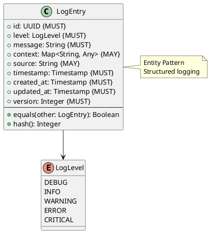

# Log Entry Entity

**Context:** Observability
**Type:** Entity
**Version:** 1.0.0
**Date:** 2025-12-04

---

## 1. Overview

The `LogEntry` entity represents a structured log message with context and severity level.

---

## 2. Structure



---

## 3. Field Specifications

### 3.1 level

- **Type:** LogLevel (Enum)
- **Constraint:** MUST
- **Values:** `DEBUG`, `INFO`, `WARNING`, `ERROR`, `CRITICAL`

### 3.2 message

- **Type:** String
- **Constraint:** MUST
- **Description:** Log message text

### 3.3 context

- **Type:** Map<String, Any>
- **Constraint:** MAY
- **Description:** Additional context (model_id, job_id, etc.)

### 3.4 source

- **Type:** String
- **Constraint:** MAY
- **Description:** Log source component
- **Examples:** `lifecycle_manager`, `inference_queue`, `model_worker`

### 3.5 timestamp

- **Type:** Timestamp
- **Constraint:** MUST
- **Description:** When log was generated

---

## 4. Serialization

```json
{
  "id": "33000000-e29b-41d4-a716-446655440015",
  "level": "error",
  "message": "Model inference timeout",
  "context": {
    "model_id": "sentence-transformers/all-MiniLM-L6-v2",
    "job_id": "ee0e8400-e29b-41d4-a716-446655440010",
    "timeout_seconds": 60
  },
  "source": "model_worker",
  "timestamp": "2025-12-04T10:30:15.123Z",
  "created_at": "2025-12-04T10:30:15.123Z",
  "updated_at": "2025-12-04T10:30:15.123Z",
  "version": 1
}
```

---

## 5. Database Schema

```sql
CREATE TYPE log_level_enum AS ENUM (
    'debug',
    'info',
    'warning',
    'error',
    'critical'
);

CREATE TABLE log_entry (
    id UUID PRIMARY KEY,
    level log_level_enum NOT NULL,
    message TEXT NOT NULL,
    context JSONB,
    source VARCHAR(255),
    timestamp TIMESTAMP NOT NULL,
    created_at TIMESTAMP NOT NULL DEFAULT NOW(),
    updated_at TIMESTAMP NOT NULL DEFAULT NOW(),
    version_number INTEGER NOT NULL DEFAULT 1
);

CREATE INDEX idx_log_entry_level ON log_entry(level);
CREATE INDEX idx_log_entry_timestamp ON log_entry(timestamp);
CREATE INDEX idx_log_entry_source ON log_entry(source);
CREATE INDEX idx_log_entry_context ON log_entry USING GIN (context);
```

---

## 6. Usage Example

```python
# Log error
log_entry = LogEntry(
    id=generate_uuid(),
    level=LogLevel.ERROR,
    message="Model inference timeout",
    context={
        "model_id": "sentence-transformers/all-MiniLM-L6-v2",
        "job_id": str(job.id),
        "timeout_seconds": 60
    },
    source="model_worker",
    timestamp=now(),
    created_at=now(),
    updated_at=now(),
    version=1
)
```

---

## 7. Related Models

- [Trace](./trace.md) - Distributed tracing context
- [Metric](./metric.md) - Quantitative measurements
