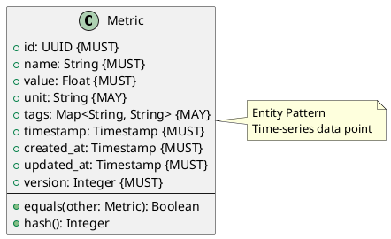

# Metric Entity

**Context:** Observability
**Type:** Entity
**Version:** 1.0.0
**Date:** 2025-12-04

---

## 1. Overview

The `Metric` entity represents a time-series data point for system and model monitoring.

---

## 2. Structure



---

## 3. Field Specifications

### 3.1 name

- **Type:** String
- **Constraint:** MUST
- **Examples:** `model.inference.latency`, `system.memory.used`, `queue.depth`

### 3.2 value

- **Type:** Float
- **Constraint:** MUST
- **Description:** Numeric metric value

### 3.3 unit

- **Type:** String
- **Constraint:** MAY
- **Examples:** `ms`, `mb`, `count`, `percent`

### 3.4 tags

- **Type:** Map<String, String>
- **Constraint:** MAY
- **Description:** Dimensional tags (model_id, region, etc.)
- **Example:** `{"model_id": "...", "priority": "high"}`

### 3.5 timestamp

- **Type:** Timestamp
- **Constraint:** MUST
- **Description:** When metric was recorded

---

## 4. Common Metrics

- `model.inference.latency` - Inference response time (ms)
- `model.inference.count` - Request count
- `model.memory.used` - Memory usage (MB)
- `queue.depth` - Pending jobs count
- `model.health.status` - Health check result (0/1)

---

## 5. Serialization

```json
{
  "id": "22000000-e29b-41d4-a716-446655440014",
  "name": "model.inference.latency",
  "value": 45.3,
  "unit": "ms",
  "tags": {
    "model_id": "sentence-transformers/all-MiniLM-L6-v2",
    "priority": "high"
  },
  "timestamp": "2025-12-04T10:30:15.123Z",
  "created_at": "2025-12-04T10:30:15.123Z",
  "updated_at": "2025-12-04T10:30:15.123Z",
  "version": 1
}
```

---

## 6. Database Schema

```sql
CREATE TABLE metric (
    id UUID PRIMARY KEY,
    name VARCHAR(255) NOT NULL,
    value REAL NOT NULL,
    unit VARCHAR(50),
    tags JSONB,
    timestamp TIMESTAMP NOT NULL,
    created_at TIMESTAMP NOT NULL DEFAULT NOW(),
    updated_at TIMESTAMP NOT NULL DEFAULT NOW(),
    version_number INTEGER NOT NULL DEFAULT 1
);

CREATE INDEX idx_metric_name ON metric(name);
CREATE INDEX idx_metric_timestamp ON metric(timestamp);
CREATE INDEX idx_metric_tags ON metric USING GIN (tags);
```

---

## 7. Related Models

- [Loaded Model](../lifecycle/loaded_model.md) - Generates metrics
- [Inference Job](../inference/inference_job.md) - Generates latency metrics
