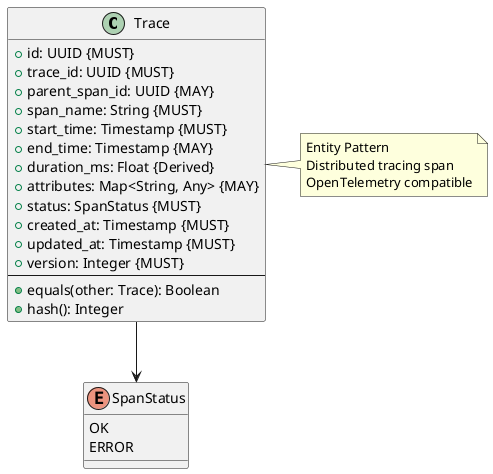

# Trace Entity

**Context:** Observability
**Type:** Entity
**Version:** 1.0.0
**Date:** 2025-12-04

---

## 1. Overview

The `Trace` entity represents a distributed tracing span for tracking request flow across system components.

---

## 2. Structure



---

## 3. Field Specifications

### 3.1 trace_id

- **Type:** UUID
- **Constraint:** MUST
- **Description:** Unique identifier for entire trace

### 3.2 parent_span_id

- **Type:** UUID
- **Constraint:** MAY
- **Description:** Parent span ID (null for root span)

### 3.3 span_name

- **Type:** String
- **Constraint:** MUST
- **Description:** Operation name
- **Examples:** `model.load`, `inference.request`, `batch.process`

### 3.4 start_time

- **Type:** Timestamp
- **Constraint:** MUST
- **Description:** Span start time

### 3.5 end_time

- **Type:** Timestamp
- **Constraint:** MAY
- **Description:** Span end time (null if ongoing)

### 3.6 duration_ms (Derived)

- **Type:** Float
- **Calculation:** `(end_time - start_time) * 1000`

### 3.7 attributes

- **Type:** Map<String, Any>
- **Constraint:** MAY
- **Description:** Span attributes (model_id, job_id, etc.)

### 3.8 status

- **Type:** SpanStatus
- **Constraint:** MUST
- **Values:** `OK`, `ERROR`

---

## 4. Serialization

```json
{
  "id": "44000000-e29b-41d4-a716-446655440016",
  "trace_id": "55000000-e29b-41d4-a716-446655440017",
  "parent_span_id": null,
  "span_name": "inference.request",
  "start_time": "2025-12-04T10:30:00.000Z",
  "end_time": "2025-12-04T10:30:00.123Z",
  "attributes": {
    "model_id": "sentence-transformers/all-MiniLM-L6-v2",
    "job_id": "ee0e8400-e29b-41d4-a716-446655440010",
    "priority": "high"
  },
  "status": "ok",
  "created_at": "2025-12-04T10:30:00.000Z",
  "updated_at": "2025-12-04T10:30:00.123Z",
  "version": 2
}
```

---

## 5. Database Schema

```sql
CREATE TYPE span_status_enum AS ENUM ('ok', 'error');

CREATE TABLE trace (
    id UUID PRIMARY KEY,
    trace_id UUID NOT NULL,
    parent_span_id UUID,
    span_name VARCHAR(255) NOT NULL,
    start_time TIMESTAMP NOT NULL,
    end_time TIMESTAMP,
    attributes JSONB,
    status span_status_enum NOT NULL,
    created_at TIMESTAMP NOT NULL DEFAULT NOW(),
    updated_at TIMESTAMP NOT NULL DEFAULT NOW(),
    version_number INTEGER NOT NULL DEFAULT 1
);

CREATE INDEX idx_trace_trace_id ON trace(trace_id);
CREATE INDEX idx_trace_parent ON trace(parent_span_id);
CREATE INDEX idx_trace_span_name ON trace(span_name);
CREATE INDEX idx_trace_start_time ON trace(start_time);
```

---

## 6. Usage Example

```python
# Start trace
trace = Trace(
    id=generate_uuid(),
    trace_id=generate_uuid(),
    parent_span_id=None,
    span_name="inference.request",
    start_time=now(),
    attributes={
        "model_id": "sentence-transformers/all-MiniLM-L6-v2",
        "job_id": str(job.id)
    },
    status=SpanStatus.OK,
    created_at=now(),
    updated_at=now(),
    version=1
)

# Complete trace
trace.end_time = now()
trace.updated_at = now()
trace.version += 1

# Create child span
child_trace = Trace(
    id=generate_uuid(),
    trace_id=trace.trace_id,
    parent_span_id=trace.id,
    span_name="model.inference",
    start_time=now(),
    attributes={},
    status=SpanStatus.OK,
    created_at=now(),
    updated_at=now(),
    version=1
)
```

---

## 7. Related Models

- [Log Entry](./log_entry.md) - Can include trace_id for correlation
- [Metric](./metric.md) - Can include trace_id in tags
- [Inference Job](../inference/inference_job.md) - Traced operations
