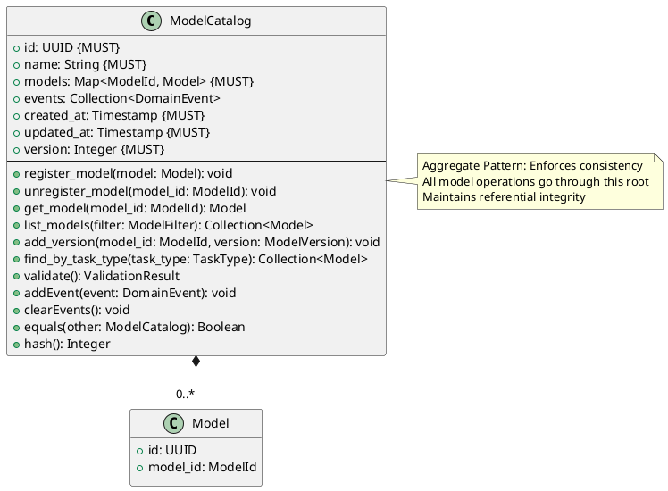
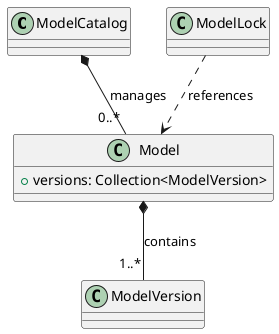

# Model Catalog Aggregate

**Context:** Registry
**Type:** Aggregate Root
**Version:** 1.0.0
**Date:** 2025-12-04

---

## 1. Overview

The `ModelCatalog` aggregate manages the collection of registered models and enforces consistency boundaries for model registration, versioning, and catalog operations.

---

## 2. Structure

### 2.1 PlantUML Diagram



### 2.2 Relationships



---

## 3. Field Specifications

### 3.1 id

- **Type:** UUID
- **Constraint:** MUST
- **Description:** Unique identifier for the catalog
- **Validation:**
  - MUST be valid UUID format
  - MUST be unique across all catalogs

### 3.2 name

- **Type:** String
- **Constraint:** MUST
- **Description:** Catalog name for identification
- **Validation:**
  - Length: 1-255 characters
  - Examples: `default`, `production-catalog`, `experimental`

### 3.3 models

- **Type:** Map<ModelId, Model>
- **Constraint:** MUST
- **Description:** Collection of registered models indexed by ModelId
- **Validation:**
  - Keys MUST be unique ModelId values
  - Values MUST be valid Model entities

### 3.4 events

- **Type:** Collection\<DomainEvent>
- **Constraint:** Internal
- **Description:** Domain events generated by aggregate operations
- **Validation:**
  - Used for event sourcing and notifications
  - Cleared after event dispatch

### 3.5 Entity Pattern Fields

- **created_at:** Timestamp when catalog was created (immutable)
- **updated_at:** Timestamp of last modification (auto-update)
- **version:** Integer for optimistic locking (auto-increment)

---

## 4. Constraints

### 4.1 Aggregate Pattern Constraints

- External code MUST NOT directly modify Model entities
- All model changes MUST go through ModelCatalog methods
- Aggregate MUST maintain invariants across all operations
- Events MUST be generated for all state changes

### 4.2 Entity Pattern Constraints

- `id` MUST be unique across all ModelCatalog entities
- `created_at` MUST NOT be modified after creation
- `updated_at` MUST be updated on every modification
- `version` MUST increment on every modification

### 4.3 Uniqueness Constraints

- Each ModelId MUST appear at most once in `models` map
- Catalog `name` SHOULD be unique for easier identification

### 4.4 Referential Integrity

- Cannot delete catalog if models are referenced by active locks
- Deleting catalog cascades to all contained models and versions

### 4.5 Business Rules

- Cannot register model with duplicate ModelId
- Cannot add version to non-existent model
- Model MUST have at least one version after registration
- ModelId format MUST be validated before registration

---

## 5. Validation

### 5.1 Syntax Validation

```python
def validate_syntax(catalog: ModelCatalog) -> ValidationResult:
    errors = []

    # Required fields
    if not catalog.id:
        errors.append("id is required")
    if not catalog.name:
        errors.append("name is required")
    if catalog.models is None:
        errors.append("models collection is required")

    # Validate each model
    for model_id, model in catalog.models.items():
        model_errors = validate_model_syntax(model)
        errors.extend([f"Model {model_id}: {e}" for e in model_errors])

    return ValidationResult(valid=len(errors) == 0, errors=errors)
```

### 5.2 Semantic Validation

```python
def validate_semantic(catalog: ModelCatalog) -> ValidationResult:
    errors = []

    # Check model consistency
    for model_id, model in catalog.models.items():
        if model.model_id != model_id:
            errors.append(f"Model key {model_id} doesn't match model.model_id {model.model_id}")

        # Each model must have versions
        if not model.versions or len(model.versions) == 0:
            errors.append(f"Model {model_id} has no versions")

    return ValidationResult(valid=len(errors) == 0, errors=errors)
```

### 5.3 Invariant Validation

```python
def validate(self) -> ValidationResult:
    """Validate aggregate invariants"""
    errors = []

    # All models must be valid
    for model in self.models.values():
        result = model.validate()
        if not result.valid:
            errors.extend(result.errors)

    # Referential integrity
    for model in self.models.values():
        for version in model.versions:
            if version.model_id != model.model_id:
                errors.append(
                    f"Version {version.id} references wrong model {version.model_id}"
                )

    return ValidationResult(valid=len(errors) == 0, errors=errors)
```

---

## 6. Behavior

### 6.1 Model Registration

```python
def register_model(self, model: Model) -> None:
    """Register a new model in the catalog"""
    # Validate model doesn't exist
    if model.model_id in self.models:
        raise ValueError(f"Model {model.model_id} already registered")

    # Validate model has at least one version
    if not model.versions or len(model.versions) == 0:
        raise ValueError("Model must have at least one version")

    # Add to catalog
    self.models[model.model_id] = model
    self.updated_at = current_timestamp()
    self.version += 1

    # Generate event
    self.addEvent(ModelRegisteredEvent(
        catalog_id=self.id,
        model_id=model.model_id,
        timestamp=current_timestamp()
    ))
```

### 6.2 Model Unregistration

```python
def unregister_model(self, model_id: ModelId) -> None:
    """Remove a model from the catalog"""
    if model_id not in self.models:
        raise ValueError(f"Model {model_id} not found")

    model = self.models[model_id]
    del self.models[model_id]
    self.updated_at = current_timestamp()
    self.version += 1

    # Generate event
    self.addEvent(ModelUnregisteredEvent(
        catalog_id=self.id,
        model_id=model_id,
        timestamp=current_timestamp()
    ))
```

### 6.3 Version Management

```python
def add_version(self, model_id: ModelId, version: ModelVersion) -> None:
    """Add a new version to an existing model"""
    if model_id not in self.models:
        raise ValueError(f"Model {model_id} not found")

    model = self.models[model_id]

    # Delegate to model entity
    model.add_version(version)

    self.updated_at = current_timestamp()
    self.version += 1

    # Generate event
    self.addEvent(ModelVersionAddedEvent(
        catalog_id=self.id,
        model_id=model_id,
        version=version.version,
        timestamp=current_timestamp()
    ))
```

### 6.4 Query Operations

```python
def get_model(self, model_id: ModelId) -> Model:
    """Retrieve a model by ID"""
    if model_id not in self.models:
        raise ValueError(f"Model {model_id} not found")
    return self.models[model_id]

def list_models(self, filter: ModelFilter = None) -> Collection[Model]:
    """List models with optional filtering"""
    models = list(self.models.values())

    if filter:
        if filter.task_type:
            models = [m for m in models if m.task_type == filter.task_type]
        if filter.search_text:
            models = [m for m in models if filter.search_text in str(m.model_id)]

    return models

def find_by_task_type(self, task_type: TaskType) -> Collection[Model]:
    """Find all models supporting a task type"""
    return [m for m in self.models.values() if m.task_type == task_type]
```

### 6.5 Event Management

```python
def addEvent(self, event: DomainEvent) -> None:
    """Add a domain event"""
    self.events.append(event)

def clearEvents(self) -> None:
    """Clear all pending events"""
    self.events.clear()
```

### 6.6 Identity Methods

```python
def equals(self, other: ModelCatalog) -> bool:
    """Identity-based equality"""
    return self.id == other.id

def hash(self) -> int:
    """Hash based on identity"""
    return hash(self.id)
```

---

## 7. Domain Events

### 7.1 ModelRegisteredEvent

```python
class ModelRegisteredEvent:
    catalog_id: UUID
    model_id: ModelId
    task_type: TaskType
    timestamp: Timestamp
```

### 7.2 ModelUnregisteredEvent

```python
class ModelUnregisteredEvent:
    catalog_id: UUID
    model_id: ModelId
    timestamp: Timestamp
```

### 7.3 ModelVersionAddedEvent

```python
class ModelVersionAddedEvent:
    catalog_id: UUID
    model_id: ModelId
    version: String
    timestamp: Timestamp
```

---

## 8. Serialization

### 8.1 JSON Example

```json
{
  "id": "770e8400-e29b-41d4-a716-446655440003",
  "name": "default",
  "models": {
    "sentence-transformers/all-MiniLM-L6-v2": {
      "id": "880e8400-e29b-41d4-a716-446655440004",
      "model_id": "sentence-transformers/all-MiniLM-L6-v2",
      "task_type": "txt2embed",
      "versions": [
        {
          "id": "990e8400-e29b-41d4-a716-446655440005",
          "version": "v2.2.2",
          "checksum": "sha256:abc123..."
        }
      ]
    }
  },
  "created_at": "2025-12-04T10:30:00Z",
  "updated_at": "2025-12-04T10:30:00Z",
  "version": 1
}
```

### 8.2 Protocol Buffers

```protobuf
message ModelCatalog {
  string id = 1;
  string name = 2;
  map<string, Model> models = 3;
  google.protobuf.Timestamp created_at = 4;
  google.protobuf.Timestamp updated_at = 5;
  int32 version_number = 6;
}
```

---

## 9. Database Schema

```sql
CREATE TABLE model_catalog (
    id UUID PRIMARY KEY,
    name VARCHAR(255) NOT NULL,
    created_at TIMESTAMP NOT NULL DEFAULT NOW(),
    updated_at TIMESTAMP NOT NULL DEFAULT NOW(),
    version_number INTEGER NOT NULL DEFAULT 1
);

-- Models belong to catalog
CREATE TABLE model (
    id UUID PRIMARY KEY,
    catalog_id UUID NOT NULL REFERENCES model_catalog(id) ON DELETE CASCADE,
    model_id VARCHAR(255) NOT NULL,
    task_type task_type_enum NOT NULL,
    ...
    UNIQUE (catalog_id, model_id)
);

CREATE INDEX idx_model_catalog_id ON model(catalog_id);

-- Trigger to auto-update updated_at and version
CREATE TRIGGER update_model_catalog_timestamp
BEFORE UPDATE ON model_catalog
FOR EACH ROW
EXECUTE FUNCTION update_timestamp_and_version();
```

---

## 10. Usage Examples

### 10.1 Creating Catalog

```python
# Create new catalog
catalog = ModelCatalog(
    id=generate_uuid(),
    name="production-catalog",
    models={},
    events=[],
    created_at=current_timestamp(),
    updated_at=current_timestamp(),
    version=1
)
```

### 10.2 Registering Models

```python
# Register a model
model = Model(
    id=generate_uuid(),
    model_id="sentence-transformers/all-MiniLM-L6-v2",
    task_type=TaskType.from_string("txt2embed"),
    versions=[version1]
)

catalog.register_model(model)

# Events are generated
for event in catalog.events:
    event_bus.publish(event)
catalog.clearEvents()
```

### 10.3 Querying Catalog

```python
# Get specific model
model = catalog.get_model("sentence-transformers/all-MiniLM-L6-v2")

# Find models by task type
embedding_models = catalog.find_by_task_type(TaskType.from_string("txt2embed"))

# List with filter
filter = ModelFilter(task_type=TaskType.from_string("txt2txt"))
text_models = catalog.list_models(filter)
```

### 10.4 Version Management

```python
# Add new version to existing model
new_version = ModelVersion(
    id=generate_uuid(),
    model_id="sentence-transformers/all-MiniLM-L6-v2",
    version="v2.3.0",
    checksum="sha256:new123...",
    artifact_uri="https://...",
    resource_requirements=ResourceRequirements(...)
)

catalog.add_version(
    model_id="sentence-transformers/all-MiniLM-L6-v2",
    version=new_version
)
```

### 10.5 Transaction Pattern

```python
def register_model_transaction(catalog: ModelCatalog, model: Model):
    """Register model with transactional event publishing"""
    try:
        # Validate
        result = catalog.validate()
        if not result.valid:
            raise ValidationError(result.errors)

        # Register
        catalog.register_model(model)

        # Persist
        repository.save(catalog)

        # Publish events
        for event in catalog.events:
            event_bus.publish(event)
        catalog.clearEvents()

        # Commit transaction
        transaction.commit()
    except Exception as e:
        transaction.rollback()
        raise
```

---

## 11. Related Models

- [Model Entity](./model_entity.md) - Child entity managed by aggregate
- [Model Version](./model_version.md) - Grandchild entity
- [Model Lock](./model_lock.md) - References models in catalog
- [Domain Events](../events/domain_events.md) - Events generated by catalog operations
