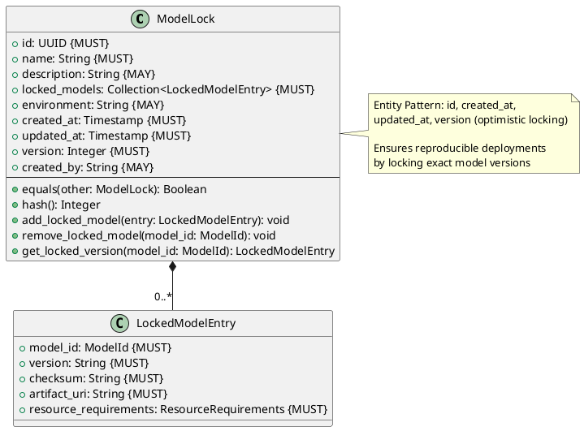
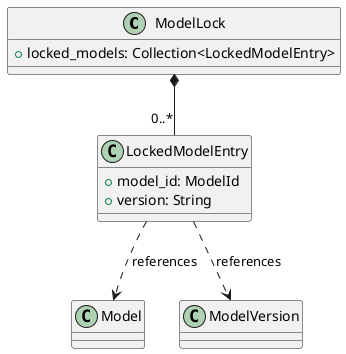

# Model Lock Entity

**Context:** Registry
**Type:** Entity
**Version:** 1.0.0
**Date:** 2025-12-04

---

## 1. Overview

The `ModelLock` entity provides reproducible deployment by locking specific model versions with their exact configurations and checksums. It's analogous to a `package-lock.json` file, ensuring consistent deployments across environments.

---

## 2. Structure

### 2.1 PlantUML Diagram



### 2.2 Relationships



---

## 3. Field Specifications

### 3.1 id

- **Type:** UUID
- **Constraint:** MUST
- **Description:** Unique identifier for the lock file
- **Validation:**
  - MUST be valid UUID format
  - MUST be unique across all lock files

### 3.2 name

- **Type:** String
- **Constraint:** MUST
- **Description:** Human-readable name for the lock file
- **Validation:**
  - Length: 1-255 characters
  - Examples: `production-v1`, `experiment-baseline`

### 3.3 description

- **Type:** String
- **Constraint:** MAY
- **Description:** Detailed description of the lock file purpose
- **Validation:**
  - Length: 0-1000 characters

### 3.4 locked_models

- **Type:** Collection\<LockedModelEntry>
- **Constraint:** MUST
- **Description:** Set of locked model versions
- **Validation:**
  - MUST contain at least one entry
  - Each entry MUST have unique model_id

### 3.5 environment

- **Type:** String
- **Constraint:** MAY
- **Description:** Target environment for this lock
- **Validation:**
  - Common values: `production`, `staging`, `development`
  - Length: 1-50 characters

### 3.6 Entity Pattern Fields

- **created_at:** Timestamp when lock was created (immutable)
- **updated_at:** Timestamp of last modification (auto-update)
- **version:** Integer for optimistic locking (auto-increment)
- **created_by:** User who created the lock file (optional)

---

## 4. Nested Type: LockedModelEntry

### 4.1 model_id

- **Type:** ModelId
- **Constraint:** MUST
- **Description:** Model identifier
- **Validation:**
  - MUST match pattern: `{org}/{repo}`

### 4.2 version

- **Type:** String
- **Constraint:** MUST
- **Description:** Locked version string
- **Validation:**
  - MUST be semantic version or branch name
  - Length: 1-100 characters

### 4.3 checksum

- **Type:** String
- **Constraint:** MUST
- **Description:** SHA256 hash of locked artifacts
- **Validation:**
  - MUST be valid SHA256 format: `sha256:{64-char-hex}`

### 4.4 artifact_uri

- **Type:** String (URL)
- **Constraint:** MUST
- **Description:** Exact artifact location
- **Validation:**
  - MUST be valid URL format

### 4.5 resource_requirements

- **Type:** ResourceRequirements
- **Constraint:** MUST
- **Description:** Resource needs for this version
- **Validation:**
  - MUST contain valid resource specifications

---

## 5. Constraints

### 5.1 Entity Pattern Constraints

- `id` MUST be unique across all ModelLock entities
- `created_at` MUST NOT be modified after creation
- `updated_at` MUST be updated on every modification
- `version` MUST increment on every modification

### 5.2 Uniqueness Constraints

- `name` SHOULD be unique for easier identification
- Within `locked_models`, each `model_id` MUST be unique

### 5.3 Referential Integrity

- Each `LockedModelEntry.model_id` SHOULD reference existing Model
- Each `LockedModelEntry.version` SHOULD reference existing ModelVersion
- However, lock files MAY contain references to deleted models (historical record)

### 5.4 Business Rules

- Locked entries are immutable snapshots (checksum verification)
- Adding/removing entries creates new lock version
- Lock files enable rollback and audit trails
- SHOULD verify checksums before deployment

---

## 6. Validation

### 6.1 Syntax Validation

```python
def validate_syntax(lock: ModelLock) -> ValidationResult:
    errors = []

    # Required fields
    if not lock.id:
        errors.append("id is required")
    if not lock.name:
        errors.append("name is required")
    if not lock.locked_models or len(lock.locked_models) == 0:
        errors.append("locked_models must contain at least one entry")

    # Validate each locked entry
    for entry in lock.locked_models:
        if not entry.model_id:
            errors.append(f"model_id is required for entry")
        if not entry.version:
            errors.append(f"version is required for entry {entry.model_id}")
        if not entry.checksum or not entry.checksum.startswith("sha256:"):
            errors.append(f"valid checksum required for entry {entry.model_id}")
        if not entry.artifact_uri:
            errors.append(f"artifact_uri is required for entry {entry.model_id}")

    # Check for duplicate model_ids
    model_ids = [e.model_id for e in lock.locked_models]
    if len(model_ids) != len(set(model_ids)):
        errors.append("locked_models contains duplicate model_ids")

    return ValidationResult(valid=len(errors) == 0, errors=errors)
```

### 6.2 Semantic Validation

```python
def validate_semantic(lock: ModelLock, registry: Registry) -> ValidationResult:
    errors = []
    warnings = []

    for entry in lock.locked_models:
        # Warn if model doesn't exist (may have been deleted)
        if not registry.model_exists(entry.model_id):
            warnings.append(f"Model {entry.model_id} not found in registry")

        # Verify checksum matches if version exists
        version = registry.get_version(entry.model_id, entry.version)
        if version and version.checksum != entry.checksum:
            errors.append(f"Checksum mismatch for {entry.model_id}@{entry.version}")

    return ValidationResult(
        valid=len(errors) == 0,
        errors=errors,
        warnings=warnings
    )
```

---

## 7. Behavior

### 7.1 Creation

```python
def create_model_lock(
    name: str,
    locked_models: List[LockedModelEntry],
    description: str = None,
    environment: str = None
) -> ModelLock:
    """Create a new model lock file"""
    return ModelLock(
        id=generate_uuid(),
        name=name,
        description=description,
        locked_models=locked_models,
        environment=environment,
        created_at=current_timestamp(),
        updated_at=current_timestamp(),
        version=1
    )
```

### 7.2 Lock Management

```python
def add_locked_model(self, entry: LockedModelEntry) -> None:
    """Add a model to the lock file"""
    if any(e.model_id == entry.model_id for e in self.locked_models):
        raise ValueError(f"Model {entry.model_id} already locked")

    self.locked_models.append(entry)
    self.updated_at = current_timestamp()
    self.version += 1

def remove_locked_model(self, model_id: ModelId) -> None:
    """Remove a model from the lock file"""
    self.locked_models = [e for e in self.locked_models if e.model_id != model_id]
    self.updated_at = current_timestamp()
    self.version += 1

def get_locked_version(self, model_id: ModelId) -> LockedModelEntry:
    """Get locked version for a model"""
    for entry in self.locked_models:
        if entry.model_id == model_id:
            return entry
    return None
```

### 7.3 Identity Methods

```python
def equals(self, other: ModelLock) -> bool:
    """Identity-based equality"""
    return self.id == other.id

def hash(self) -> int:
    """Hash based on identity"""
    return hash(self.id)
```

---

## 8. Serialization

### 8.1 JSON Example

```json
{
  "id": "660e8400-e29b-41d4-a716-446655440002",
  "name": "production-v1",
  "description": "Production deployment lock for Q4 2025",
  "environment": "production",
  "locked_models": [
    {
      "model_id": "sentence-transformers/all-MiniLM-L6-v2",
      "version": "v2.2.2",
      "checksum": "sha256:abc123def456789abc123def456789abc123def456789abc123def456789abcd",
      "artifact_uri": "https://huggingface.co/sentence-transformers/all-MiniLM-L6-v2/resolve/v2.2.2/model.safetensors",
      "resource_requirements": {
        "memory_mb": 512,
        "gpu_vram_mb": 0,
        "cpu_threads": 2
      }
    },
    {
      "model_id": "meta-llama/Llama-3.1-8B",
      "version": "v1.0.0",
      "checksum": "sha256:def789abc123456def789abc123456def789abc123456def789abc123456def",
      "artifact_uri": "s3://models/llama-3.1-8b/model.safetensors",
      "resource_requirements": {
        "memory_mb": 16384,
        "gpu_vram_mb": 16384,
        "cpu_threads": 8
      }
    }
  ],
  "created_at": "2025-12-04T10:30:00Z",
  "updated_at": "2025-12-04T10:30:00Z",
  "version": 1
}
```

### 8.2 YAML Format (Lock File)

```yaml
# ModelMora Lock File - production-v1
name: production-v1
description: Production deployment lock for Q4 2025
environment: production
created_at: 2025-12-04T10:30:00Z

locked_models:
  - model_id: sentence-transformers/all-MiniLM-L6-v2
    version: v2.2.2
    checksum: sha256:abc123def456789abc123def456789abc123def456789abc123def456789abcd
    artifact_uri: https://huggingface.co/sentence-transformers/all-MiniLM-L6-v2/resolve/v2.2.2/model.safetensors
    resource_requirements:
      memory_mb: 512
      gpu_vram_mb: 0
      cpu_threads: 2

  - model_id: meta-llama/Llama-3.1-8B
    version: v1.0.0
    checksum: sha256:def789abc123456def789abc123456def789abc123456def789abc123456def
    artifact_uri: s3://models/llama-3.1-8b/model.safetensors
    resource_requirements:
      memory_mb: 16384
      gpu_vram_mb: 16384
      cpu_threads: 8
```

---

## 9. Database Schema

```sql
CREATE TABLE model_lock (
    id UUID PRIMARY KEY,
    name VARCHAR(255) NOT NULL,
    description TEXT,
    environment VARCHAR(50),
    created_at TIMESTAMP NOT NULL DEFAULT NOW(),
    updated_at TIMESTAMP NOT NULL DEFAULT NOW(),
    version_number INTEGER NOT NULL DEFAULT 1,
    created_by VARCHAR(255)
);

CREATE TABLE locked_model_entry (
    lock_id UUID NOT NULL REFERENCES model_lock(id) ON DELETE CASCADE,
    model_id VARCHAR(255) NOT NULL,
    version VARCHAR(100) NOT NULL,
    checksum VARCHAR(71) NOT NULL,
    artifact_uri TEXT NOT NULL,
    resource_requirements JSONB NOT NULL,
    PRIMARY KEY (lock_id, model_id)
);

CREATE INDEX idx_model_lock_name ON model_lock(name);
CREATE INDEX idx_model_lock_environment ON model_lock(environment);
CREATE INDEX idx_locked_entry_lock_id ON locked_model_entry(lock_id);

-- Trigger to auto-update updated_at and version
CREATE TRIGGER update_model_lock_timestamp
BEFORE UPDATE ON model_lock
FOR EACH ROW
EXECUTE FUNCTION update_timestamp_and_version();
```

---

## 10. Usage Examples

### 10.1 Creating Lock File

```python
# Create lock from current registry state
entries = [
    LockedModelEntry(
        model_id="sentence-transformers/all-MiniLM-L6-v2",
        version="v2.2.2",
        checksum="sha256:abc123...",
        artifact_uri="https://...",
        resource_requirements=ResourceRequirements(...)
    )
]

lock = create_model_lock(
    name="production-v1",
    locked_models=entries,
    description="Production deployment",
    environment="production"
)
```

### 10.2 Deploying from Lock

```python
# Load models from lock file
lock = registry.get_lock("production-v1")

for entry in lock.locked_models:
    # Verify checksum
    if not verify_checksum(entry.artifact_uri, entry.checksum):
        raise IntegrityError(f"Checksum mismatch for {entry.model_id}")

    # Load exact version
    lifecycle_manager.load_model(
        model_id=entry.model_id,
        version=entry.version,
        artifact_uri=entry.artifact_uri
    )
```

### 10.3 Lock File Export/Import

```python
# Export to YAML file
lock_yaml = lock.to_yaml()
with open("modelmora.lock", "w") as f:
    f.write(lock_yaml)

# Import from YAML file
with open("modelmora.lock", "r") as f:
    lock = ModelLock.from_yaml(f.read())
    registry.register_lock(lock)
```

---

## 11. Related Models

- [Model Entity](./model_entity.md) - Referenced model
- [Model Version](./model_version.md) - Locked version details
- [Resource Requirements](./resource_requirements.md) - Resource specifications
