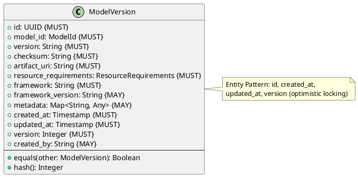
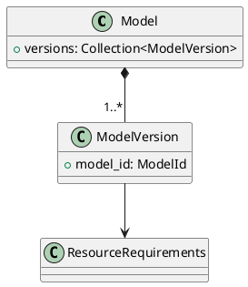

# Model Version Entity

**Context:** Registry
**Type:** Entity
**Version:** 1.0.0
**Date:** 2025-12-04

---

## 1. Overview

The `ModelVersion` entity represents a specific version of a model, including its artifacts, metadata, and resource requirements. It enables version tracking, reproducible deployments, and rollback capabilities.

---

## 2. Structure

### 2.1 PlantUML Diagram



### 2.2 Relationships



---

## 3. Field Specifications

### 3.1 id

- **Type:** UUID
- **Constraint:** MUST
- **Description:** Unique identifier for the model version
- **Validation:**
  - MUST be valid UUID format
  - MUST be unique across all model versions

### 3.2 model_id

- **Type:** ModelId (Value Object)
- **Constraint:** MUST
- **Description:** Reference to parent model entity
- **Validation:**
  - MUST match pattern: `{org}/{repo}`
  - MUST reference existing model in registry

### 3.3 version

- **Type:** String
- **Constraint:** MUST
- **Description:** Version identifier (semantic version or branch name)
- **Validation:**
  - MUST match pattern: `v{major}.{minor}.{patch}` OR branch name
  - Examples: `v2.2.2`, `main`, `dev`
  - Length: 1-100 characters

### 3.4 checksum

- **Type:** String
- **Constraint:** MUST
- **Description:** SHA256 hash of model artifacts for integrity verification
- **Validation:**
  - MUST be valid SHA256 format: `sha256:{64-char-hex}`
  - Example: `sha256:abc123...def789`

### 3.5 artifact_uri

- **Type:** String (URL)
- **Constraint:** MUST
- **Description:** Location of model artifacts
- **Validation:**
  - MUST be valid URL format
  - Supported schemes: `https://`, `s3://`, `file://`
  - Examples: `https://huggingface.co/...`, `s3://bucket/model.bin`

### 3.6 resource_requirements

- **Type:** ResourceRequirements (Value Object)
- **Constraint:** MUST
- **Description:** Compute resources needed to run this version
- **Validation:**
  - MUST contain valid resource specifications
  - See ResourceRequirements model for details

### 3.7 framework

- **Type:** String
- **Constraint:** MUST
- **Description:** ML framework used by this version
- **Validation:**
  - MUST be one of: `pytorch`, `tensorflow`, `jax`, `onnx`
  - Length: 1-50 characters

### 3.8 framework_version

- **Type:** String
- **Constraint:** MAY
- **Description:** Specific framework version
- **Validation:**
  - SHOULD follow semantic versioning
  - Example: `2.0.1`, `2.11.0`
  - Length: 1-50 characters

### 3.9 metadata

- **Type:** Map<String, Any>
- **Constraint:** MAY
- **Description:** Additional version-specific metadata
- **Examples:**
  - `author`, `license`, `tags`, `description`
  - `training_dataset`, `accuracy_metrics`

### 3.10 Entity Pattern Fields

- **created_at:** Timestamp when version was registered (immutable)
- **updated_at:** Timestamp of last modification (auto-update)
- **version:** Integer for optimistic locking (auto-increment)
- **created_by:** User who registered this version (optional)

---

## 4. Constraints

### 4.1 Entity Pattern Constraints

- `id` MUST be unique across all ModelVersion entities
- `created_at` MUST NOT be modified after creation
- `updated_at` MUST be updated on every modification
- `version` MUST increment on every modification

### 4.2 Uniqueness Constraints

- `(model_id, version)` combination MUST be unique
- `checksum` SHOULD be unique (same artifacts shouldn't be registered twice)

### 4.3 Referential Integrity

- `model_id` MUST reference existing Model entity
- Deleting a Model MUST cascade delete all its ModelVersion entities

### 4.4 Business Rules

- Cannot modify `checksum` after creation
- Cannot modify `artifact_uri` after creation (immutable artifact location)
- `version` string cannot be reused for same `model_id` even after deletion
- Framework and framework_version SHOULD match artifact's actual implementation

---

## 5. Validation

### 5.1 Syntax Validation

```python
def validate_syntax(model_version: ModelVersion) -> ValidationResult:
    errors = []

    # Required fields
    if not model_version.id:
        errors.append("id is required")
    if not model_version.model_id:
        errors.append("model_id is required")
    if not model_version.version:
        errors.append("version is required")
    if not model_version.checksum:
        errors.append("checksum is required")
    if not model_version.artifact_uri:
        errors.append("artifact_uri is required")
    if not model_version.resource_requirements:
        errors.append("resource_requirements is required")
    if not model_version.framework:
        errors.append("framework is required")

    # Format validation
    if model_version.checksum and not model_version.checksum.startswith("sha256:"):
        errors.append("checksum must be SHA256 format")

    if model_version.framework not in ["pytorch", "tensorflow", "jax", "onnx"]:
        errors.append("framework must be one of: pytorch, tensorflow, jax, onnx")

    return ValidationResult(valid=len(errors) == 0, errors=errors)
```

### 5.2 Semantic Validation

```python
def validate_semantic(model_version: ModelVersion, registry: Registry) -> ValidationResult:
    errors = []

    # Model must exist
    if not registry.model_exists(model_version.model_id):
        errors.append(f"Model {model_version.model_id} not found")

    # Version uniqueness
    if registry.version_exists(model_version.model_id, model_version.version):
        errors.append(f"Version {model_version.version} already exists for {model_version.model_id}")

    # Artifact accessibility
    if not is_accessible(model_version.artifact_uri):
        errors.append(f"Artifact URI not accessible: {model_version.artifact_uri}")

    return ValidationResult(valid=len(errors) == 0, errors=errors)
```

---

## 6. Behavior

### 6.1 Creation

```python
def create_model_version(
    model_id: ModelId,
    version: str,
    artifact_uri: str,
    checksum: str,
    framework: str,
    resource_requirements: ResourceRequirements,
    metadata: dict = None
) -> ModelVersion:
    """Register a new model version"""
    return ModelVersion(
        id=generate_uuid(),
        model_id=model_id,
        version=version,
        artifact_uri=artifact_uri,
        checksum=checksum,
        framework=framework,
        resource_requirements=resource_requirements,
        metadata=metadata or {},
        created_at=current_timestamp(),
        updated_at=current_timestamp(),
        version=1
    )
```

### 6.2 Metadata Update

```python
def update_metadata(self, new_metadata: dict) -> None:
    """Update version metadata (non-artifact changes only)"""
    if new_metadata:
        self.metadata.update(new_metadata)
        self.updated_at = current_timestamp()
        self.version += 1
```

### 6.3 Identity Methods

```python
def equals(self, other: ModelVersion) -> bool:
    """Identity-based equality"""
    return self.id == other.id

def hash(self) -> int:
    """Hash based on identity"""
    return hash(self.id)
```

---

## 7. Serialization

### 7.1 JSON Example

```json
{
  "id": "550e8400-e29b-41d4-a716-446655440001",
  "model_id": "sentence-transformers/all-MiniLM-L6-v2",
  "version": "v2.2.2",
  "checksum": "sha256:abc123def456789abc123def456789abc123def456789abc123def456789abcd",
  "artifact_uri": "https://huggingface.co/sentence-transformers/all-MiniLM-L6-v2/resolve/v2.2.2/model.safetensors",
  "resource_requirements": {
    "memory_mb": 512,
    "gpu_vram_mb": 0,
    "cpu_threads": 2
  },
  "framework": "pytorch",
  "framework_version": "2.0.1",
  "metadata": {
    "author": "sentence-transformers",
    "license": "Apache-2.0",
    "max_seq_length": 256
  },
  "created_at": "2025-12-04T10:30:00Z",
  "updated_at": "2025-12-04T10:30:00Z",
  "version": 1
}
```

### 7.2 Protocol Buffers

```protobuf
message ModelVersion {
  string id = 1;
  string model_id = 2;
  string version = 3;
  string checksum = 4;
  string artifact_uri = 5;
  ResourceRequirements resource_requirements = 6;
  string framework = 7;
  string framework_version = 8;
  map<string, google.protobuf.Any> metadata = 9;
  google.protobuf.Timestamp created_at = 10;
  google.protobuf.Timestamp updated_at = 11;
  int32 version_number = 12;
}
```

---

## 8. Database Schema

```sql
CREATE TABLE model_version (
    id UUID PRIMARY KEY,
    model_id UUID NOT NULL REFERENCES model(id) ON DELETE CASCADE,
    version VARCHAR(100) NOT NULL,
    checksum VARCHAR(71) NOT NULL,  -- sha256: + 64 hex chars
    artifact_uri TEXT NOT NULL,
    framework VARCHAR(50) NOT NULL CHECK (framework IN ('pytorch', 'tensorflow', 'jax', 'onnx')),
    framework_version VARCHAR(50),
    metadata JSONB,
    created_at TIMESTAMP NOT NULL DEFAULT NOW(),
    updated_at TIMESTAMP NOT NULL DEFAULT NOW(),
    version_number INTEGER NOT NULL DEFAULT 1,
    created_by VARCHAR(255),
    UNIQUE (model_id, version)
);

CREATE INDEX idx_model_version_model_id ON model_version(model_id);
CREATE INDEX idx_model_version_checksum ON model_version(checksum);

-- Trigger to auto-update updated_at and version
CREATE TRIGGER update_model_version_timestamp
BEFORE UPDATE ON model_version
FOR EACH ROW
EXECUTE FUNCTION update_timestamp_and_version();
```

---

## 9. Usage Examples

### 9.1 Registering New Version

```python
# Register a new version
version = create_model_version(
    model_id="sentence-transformers/all-MiniLM-L6-v2",
    version="v2.2.2",
    artifact_uri="https://huggingface.co/.../model.safetensors",
    checksum="sha256:abc123...",
    framework="pytorch",
    resource_requirements=ResourceRequirements(
        memory_mb=512,
        gpu_vram_mb=0,
        cpu_threads=2
    ),
    metadata={
        "max_seq_length": 256,
        "author": "sentence-transformers"
    }
)
```

### 9.2 Version Comparison

```python
# Find versions for a model
versions = registry.get_versions("sentence-transformers/all-MiniLM-L6-v2")

# Get latest version
latest = max(versions, key=lambda v: parse_version(v.version))

# Get version by checksum
version = registry.get_version_by_checksum("sha256:abc123...")
```

---

## 10. Related Models

- [Model Entity](./model_entity.md) - Parent model entity
- [Resource Requirements](./resource_requirements.md) - Compute specifications
- [Model Lock](./model_lock.md) - Uses ModelVersion for reproducible deployments
