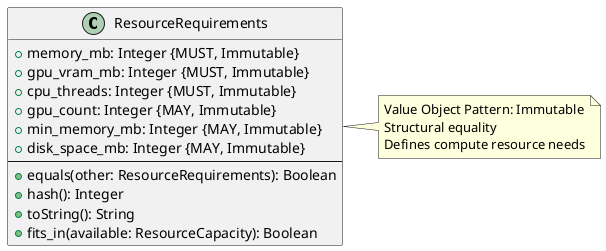

# Resource Requirements Value Object

**Context:** Registry
**Type:** Value Object
**Version:** 1.0.0
**Date:** 2025-12-04

---

## 1. Overview

The `ResourceRequirements` value object specifies the compute resources needed to load and run a model. It enables resource-aware scheduling and capacity planning.

---

## 2. Structure

### 2.1 PlantUML Diagram



---

## 3. Field Specifications

### 3.1 memory_mb

- **Type:** Integer
- **Constraint:** MUST, Immutable
- **Description:** Required system memory in megabytes
- **Validation:**
  - MUST be > 0
  - Typical range: 100 MB to 100,000 MB
  - Includes model weights + runtime overhead

### 3.2 gpu_vram_mb

- **Type:** Integer
- **Constraint:** MUST, Immutable
- **Description:** Required GPU VRAM in megabytes (0 for CPU-only)
- **Validation:**
  - MUST be >= 0
  - 0 indicates CPU-only model
  - Typical range: 0 MB to 80,000 MB

### 3.3 cpu_threads

- **Type:** Integer
- **Constraint:** MUST, Immutable
- **Description:** Number of CPU threads for inference
- **Validation:**
  - MUST be > 0
  - Typical range: 1-64 threads
  - Used for CPU inference and preprocessing

### 3.4 gpu_count

- **Type:** Integer
- **Constraint:** MAY, Immutable
- **Description:** Number of GPUs required
- **Validation:**
  - MUST be >= 0
  - Default: 0 (CPU-only) or 1 (single GPU)
  - Multi-GPU models: > 1

### 3.5 min_memory_mb

- **Type:** Integer
- **Constraint:** MAY, Immutable
- **Description:** Minimum memory for reduced precision mode
- **Validation:**
  - MUST be <= memory_mb if specified
  - Used for optimization hints

### 3.6 disk_space_mb

- **Type:** Integer
- **Constraint:** MAY, Immutable
- **Description:** Required disk space for model artifacts
- **Validation:**
  - MUST be > 0 if specified
  - Used for cache management

---

## 4. Constraints

### 4.1 Value Object Constraints

- All fields MUST be immutable after creation
- Equality based on structural comparison
- No identity field required

### 4.2 Business Rules

- `memory_mb` MUST be > 0 (models require memory)
- `gpu_vram_mb` = 0 indicates CPU-only model
- `gpu_vram_mb` > 0 AND `gpu_count` > 0 indicates GPU model
- `cpu_threads` SHOULD match available CPU cores for best performance
- `min_memory_mb` <= `memory_mb` if both specified

---

## 5. Validation

### 5.1 Syntax Validation

```python
def validate_syntax(req: ResourceRequirements) -> ValidationResult:
    errors = []

    # Required fields
    if req.memory_mb is None:
        errors.append("memory_mb is required")
    elif req.memory_mb <= 0:
        errors.append("memory_mb must be > 0")

    if req.gpu_vram_mb is None:
        errors.append("gpu_vram_mb is required")
    elif req.gpu_vram_mb < 0:
        errors.append("gpu_vram_mb must be >= 0")

    if req.cpu_threads is None:
        errors.append("cpu_threads is required")
    elif req.cpu_threads <= 0:
        errors.append("cpu_threads must be > 0")

    # Optional field validation
    if req.gpu_count is not None and req.gpu_count < 0:
        errors.append("gpu_count must be >= 0")

    if req.min_memory_mb is not None:
        if req.min_memory_mb <= 0:
            errors.append("min_memory_mb must be > 0")
        elif req.min_memory_mb > req.memory_mb:
            errors.append("min_memory_mb cannot exceed memory_mb")

    if req.disk_space_mb is not None and req.disk_space_mb <= 0:
        errors.append("disk_space_mb must be > 0")

    return ValidationResult(valid=len(errors) == 0, errors=errors)
```

### 5.2 Semantic Validation

```python
def validate_semantic(req: ResourceRequirements) -> ValidationResult:
    warnings = []

    # Reasonable ranges
    if req.memory_mb > 100000:  # > 100 GB
        warnings.append("memory_mb unusually high (> 100 GB)")

    if req.gpu_vram_mb > 80000:  # > 80 GB
        warnings.append("gpu_vram_mb exceeds common GPU capacity")

    if req.cpu_threads > 64:
        warnings.append("cpu_threads exceeds typical server capacity")

    # Consistency checks
    if req.gpu_vram_mb > 0 and (req.gpu_count is None or req.gpu_count == 0):
        warnings.append("gpu_vram_mb > 0 but gpu_count not set (assuming 1)")

    return ValidationResult(valid=True, warnings=warnings)
```

---

## 6. Behavior

### 6.1 Creation

```python
def create_resource_requirements(
    memory_mb: int,
    gpu_vram_mb: int = 0,
    cpu_threads: int = 1,
    gpu_count: int = None,
    min_memory_mb: int = None,
    disk_space_mb: int = None
) -> ResourceRequirements:
    """Create resource requirements specification"""
    return ResourceRequirements(
        memory_mb=memory_mb,
        gpu_vram_mb=gpu_vram_mb,
        cpu_threads=cpu_threads,
        gpu_count=gpu_count or (1 if gpu_vram_mb > 0 else 0),
        min_memory_mb=min_memory_mb,
        disk_space_mb=disk_space_mb
    )
```

### 6.2 Resource Checking

```python
def fits_in(self, available: ResourceCapacity) -> bool:
    """Check if requirements can be satisfied by available resources"""
    return (
        self.memory_mb <= available.memory_mb and
        self.gpu_vram_mb <= available.gpu_vram_mb and
        self.cpu_threads <= available.cpu_threads and
        (self.gpu_count or 0) <= available.gpu_count
    )
```

### 6.3 Value Object Methods

```python
def equals(self, other: ResourceRequirements) -> bool:
    """Structural equality"""
    return (
        self.memory_mb == other.memory_mb and
        self.gpu_vram_mb == other.gpu_vram_mb and
        self.cpu_threads == other.cpu_threads and
        (self.gpu_count or 0) == (other.gpu_count or 0)
    )

def hash(self) -> int:
    """Hash based on value"""
    return hash((
        self.memory_mb,
        self.gpu_vram_mb,
        self.cpu_threads,
        self.gpu_count or 0
    ))

def toString(self) -> str:
    """Human-readable representation"""
    gpu_info = f"{self.gpu_vram_mb}MB VRAM" if self.gpu_vram_mb > 0 else "CPU-only"
    return f"{self.memory_mb}MB RAM, {gpu_info}, {self.cpu_threads} threads"
```

---

## 7. Serialization

### 7.1 JSON Example

```json
{
  "memory_mb": 2048,
  "gpu_vram_mb": 0,
  "cpu_threads": 4,
  "gpu_count": 0,
  "disk_space_mb": 500
}
```

```json
{
  "memory_mb": 16384,
  "gpu_vram_mb": 16384,
  "cpu_threads": 8,
  "gpu_count": 1,
  "min_memory_mb": 12288,
  "disk_space_mb": 15000
}
```

### 7.2 Protocol Buffers

```protobuf
message ResourceRequirements {
  int32 memory_mb = 1;
  int32 gpu_vram_mb = 2;
  int32 cpu_threads = 3;
  int32 gpu_count = 4;
  int32 min_memory_mb = 5;
  int32 disk_space_mb = 6;
}
```

---

## 8. Database Schema

```sql
-- Embedded in model_version table as JSONB
CREATE TABLE model_version (
    ...
    resource_requirements JSONB NOT NULL,
    ...
);

-- Example query: Find models that fit in available resources
SELECT * FROM model_version
WHERE (resource_requirements->>'memory_mb')::int <= 8192
  AND (resource_requirements->>'gpu_vram_mb')::int = 0
  AND (resource_requirements->>'cpu_threads')::int <= 8;
```

---

## 9. Usage Examples

### 9.1 Creating Requirements

```python
# CPU-only small model
cpu_req = ResourceRequirements(
    memory_mb=512,
    gpu_vram_mb=0,
    cpu_threads=2
)

# GPU-accelerated large model
gpu_req = ResourceRequirements(
    memory_mb=16384,
    gpu_vram_mb=16384,
    cpu_threads=8,
    gpu_count=1,
    disk_space_mb=15000
)

# Multi-GPU model
multi_gpu_req = ResourceRequirements(
    memory_mb=32768,
    gpu_vram_mb=40960,  # 40 GB total
    cpu_threads=16,
    gpu_count=2
)
```

### 9.2 Resource Allocation

```python
def can_load_model(
    requirements: ResourceRequirements,
    available: ResourceCapacity
) -> bool:
    """Check if model can be loaded"""
    return requirements.fits_in(available)

# Example
available = ResourceCapacity(
    memory_mb=16384,
    gpu_vram_mb=0,
    cpu_threads=8,
    gpu_count=0
)

model_req = ResourceRequirements(memory_mb=2048, gpu_vram_mb=0, cpu_threads=4)
if can_load_model(model_req, available):
    # Load model
    pass
```

### 9.3 Resource Profiling

```python
def estimate_requirements(model_path: str) -> ResourceRequirements:
    """Estimate resource requirements from model artifacts"""
    # Get model size
    model_size_mb = get_file_size_mb(model_path)

    # Estimate memory (model size + 50% overhead)
    memory_mb = int(model_size_mb * 1.5)

    # Check for GPU support
    model_config = load_config(model_path)
    gpu_vram_mb = memory_mb if model_config.use_gpu else 0

    return ResourceRequirements(
        memory_mb=memory_mb,
        gpu_vram_mb=gpu_vram_mb,
        cpu_threads=4,  # default
        disk_space_mb=model_size_mb
    )
```

### 9.4 Comparison and Sorting

```python
def sort_by_resource_usage(models: List[Model]) -> List[Model]:
    """Sort models by total resource usage"""
    def resource_score(req: ResourceRequirements) -> int:
        return req.memory_mb + req.gpu_vram_mb

    return sorted(
        models,
        key=lambda m: resource_score(m.resource_requirements)
    )
```

---

## 10. Common Patterns

### 10.1 Resource Profiles

```python
# Predefined resource profiles
PROFILES = {
    "tiny": ResourceRequirements(memory_mb=256, gpu_vram_mb=0, cpu_threads=1),
    "small": ResourceRequirements(memory_mb=1024, gpu_vram_mb=0, cpu_threads=2),
    "medium": ResourceRequirements(memory_mb=4096, gpu_vram_mb=4096, cpu_threads=4, gpu_count=1),
    "large": ResourceRequirements(memory_mb=16384, gpu_vram_mb=16384, cpu_threads=8, gpu_count=1),
    "xlarge": ResourceRequirements(memory_mb=32768, gpu_vram_mb=40960, cpu_threads=16, gpu_count=2),
}

# Usage
model.resource_requirements = PROFILES["small"]
```

---

## 11. Related Models

- [Model Version](./model_version.md) - Contains ResourceRequirements
- [Model Lock](./model_lock.md) - Includes ResourceRequirements in locked entries
- [Loaded Model](../lifecycle/loaded_model.md) - Uses requirements for allocation
- [Memory Usage](../lifecycle/memory_usage.md) - Actual usage vs. requirements
