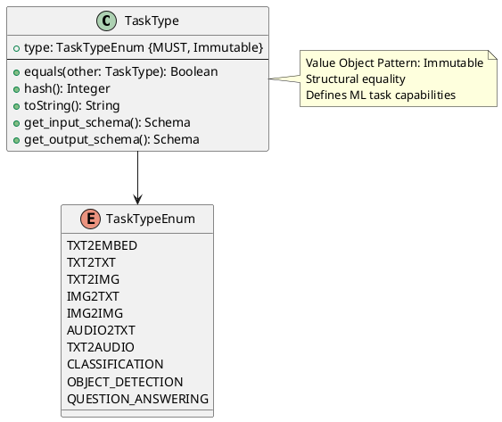

# Task Type Value Object

**Context:** Registry
**Type:** Value Object
**Version:** 1.0.0
**Date:** 2025-12-04

---

## 1. Overview

The `TaskType` value object represents the ML task capability of a model. It defines supported inference operations and determines input/output data structures.

---

## 2. Structure

### 2.1 PlantUML Diagram



---

## 3. Field Specifications

### 3.1 type

- **Type:** TaskTypeEnum
- **Constraint:** MUST, Immutable
- **Description:** The specific task type
- **Validation:**
  - MUST be one of the defined enum values

---

## 4. Task Type Enumeration

### 4.1 Supported Task Types

| Value | Description | Input | Output |
|-------|-------------|-------|--------|
| `txt2embed` | Text to embedding vector | Text string | Float array |
| `txt2txt` | Text generation/transformation | Text string | Text string |
| `txt2img` | Text to image generation | Text prompt | Image (bytes) |
| `img2txt` | Image captioning/OCR | Image (bytes) | Text string |
| `img2img` | Image transformation | Image (bytes) | Image (bytes) |
| `audio2txt` | Speech-to-text | Audio (bytes) | Text string |
| `txt2audio` | Text-to-speech | Text string | Audio (bytes) |
| `classification` | Text/image classification | Text or Image | Class labels + scores |
| `object_detection` | Object detection in images | Image (bytes) | Bounding boxes + labels |
| `question_answering` | Question answering | Question + Context | Answer text |

### 4.2 Task Type Details

#### txt2embed

- **Purpose:** Generate dense vector embeddings from text
- **Use Cases:** Semantic search, similarity, clustering
- **Input:** Single text string or batch of strings
- **Output:** Float array(s) of fixed dimension
- **Example Models:** `sentence-transformers/all-MiniLM-L6-v2`

#### txt2txt

- **Purpose:** Generate or transform text
- **Use Cases:** Completion, summarization, translation, chat
- **Input:** Text prompt/input
- **Output:** Generated text
- **Example Models:** `meta-llama/Llama-3.1-8B`, `gpt2`

#### txt2img

- **Purpose:** Generate images from text descriptions
- **Use Cases:** Image generation, creative AI
- **Input:** Text prompt + optional parameters (size, style)
- **Output:** Image binary data
- **Example Models:** `stabilityai/stable-diffusion-xl-base-1.0`

#### img2txt

- **Purpose:** Generate text descriptions from images
- **Use Cases:** Image captioning, OCR, visual QA
- **Input:** Image binary data
- **Output:** Text description
- **Example Models:** `Salesforce/blip-image-captioning-large`

#### img2img

- **Purpose:** Transform or edit images
- **Use Cases:** Style transfer, super-resolution, inpainting
- **Input:** Image binary data + optional parameters
- **Output:** Transformed image binary data
- **Example Models:** `timbrooks/instruct-pix2pix`

#### audio2txt

- **Purpose:** Transcribe speech to text
- **Use Cases:** Speech recognition, transcription
- **Input:** Audio binary data (WAV, MP3)
- **Output:** Transcribed text
- **Example Models:** `openai/whisper-large-v3`

#### txt2audio

- **Purpose:** Synthesize speech from text
- **Use Cases:** Text-to-speech, voice generation
- **Input:** Text string
- **Output:** Audio binary data
- **Example Models:** `suno/bark`

#### classification

- **Purpose:** Classify text or images into categories
- **Use Cases:** Sentiment analysis, topic classification
- **Input:** Text string or image
- **Output:** Class labels with confidence scores
- **Example Models:** `distilbert-base-uncased-finetuned-sst-2-english`

#### object_detection

- **Purpose:** Detect and locate objects in images
- **Use Cases:** Object detection, localization
- **Input:** Image binary data
- **Output:** Bounding boxes with labels and scores
- **Example Models:** `facebook/detr-resnet-50`

#### question_answering

- **Purpose:** Answer questions based on context
- **Use Cases:** QA systems, information extraction
- **Input:** Question + context text
- **Output:** Answer text + confidence
- **Example Models:** `deepset/roberta-base-squad2`

---

## 5. Constraints

### 5.1 Value Object Constraints

- `type` MUST be immutable after creation
- Equality based on `type` value (structural)
- No identity field required

### 5.2 Business Rules

- TaskType determines required input/output formats
- Models MUST implement task-specific interfaces
- Cannot change TaskType of a registered model
- Input validation rules vary by TaskType

---

## 6. Validation

### 6.1 Syntax Validation

```python
def validate_syntax(task_type: TaskType) -> ValidationResult:
    errors = []

    if not task_type.type:
        errors.append("type is required")

    valid_types = [
        "txt2embed", "txt2txt", "txt2img", "img2txt", "img2img",
        "audio2txt", "txt2audio", "classification",
        "object_detection", "question_answering"
    ]

    if task_type.type not in valid_types:
        errors.append(f"type must be one of: {', '.join(valid_types)}")

    return ValidationResult(valid=len(errors) == 0, errors=errors)
```

---

## 7. Behavior

### 7.1 Creation

```python
def create_task_type(type_str: str) -> TaskType:
    """Create a TaskType from string"""
    return TaskType(type=TaskTypeEnum[type_str.upper().replace("-", "_")])
```

### 7.2 Schema Retrieval

```python
def get_input_schema(self) -> Schema:
    """Get input data schema for this task type"""
    schemas = {
        TaskTypeEnum.TXT2EMBED: {
            "type": "object",
            "properties": {
                "text": {"type": "string"}
            },
            "required": ["text"]
        },
        TaskTypeEnum.TXT2TXT: {
            "type": "object",
            "properties": {
                "prompt": {"type": "string"},
                "max_tokens": {"type": "integer", "default": 100}
            },
            "required": ["prompt"]
        },
        # ... other task types
    }
    return schemas[self.type]

def get_output_schema(self) -> Schema:
    """Get output data schema for this task type"""
    schemas = {
        TaskTypeEnum.TXT2EMBED: {
            "type": "object",
            "properties": {
                "embedding": {
                    "type": "array",
                    "items": {"type": "number"}
                }
            }
        },
        # ... other task types
    }
    return schemas[self.type]
```

### 7.3 Value Object Methods

```python
def equals(self, other: TaskType) -> bool:
    """Structural equality"""
    return self.type == other.type

def hash(self) -> int:
    """Hash based on value"""
    return hash(self.type)

def toString(self) -> str:
    """String representation"""
    return self.type.lower()
```

---

## 8. Serialization

### 8.1 JSON Example

```json
{
  "task_type": "txt2embed"
}
```

### 8.2 Protocol Buffers

```protobuf
enum TaskType {
  TASK_TYPE_UNSPECIFIED = 0;
  TASK_TYPE_TXT2EMBED = 1;
  TASK_TYPE_TXT2TXT = 2;
  TASK_TYPE_TXT2IMG = 3;
  TASK_TYPE_IMG2TXT = 4;
  TASK_TYPE_IMG2IMG = 5;
  TASK_TYPE_AUDIO2TXT = 6;
  TASK_TYPE_TXT2AUDIO = 7;
  TASK_TYPE_CLASSIFICATION = 8;
  TASK_TYPE_OBJECT_DETECTION = 9;
  TASK_TYPE_QUESTION_ANSWERING = 10;
}
```

---

## 9. Database Schema

```sql
-- Stored as VARCHAR with CHECK constraint
CREATE TYPE task_type_enum AS ENUM (
    'txt2embed',
    'txt2txt',
    'txt2img',
    'img2txt',
    'img2img',
    'audio2txt',
    'txt2audio',
    'classification',
    'object_detection',
    'question_answering'
);

-- In model table
CREATE TABLE model (
    ...
    task_type task_type_enum NOT NULL,
    ...
);

CREATE INDEX idx_model_task_type ON model(task_type);
```

---

## 10. Usage Examples

### 10.1 Creating Task Types

```python
# From string
task = TaskType.from_string("txt2embed")

# From enum
task = TaskType(type=TaskTypeEnum.TXT2EMBED)

# Comparison
task1 = TaskType.from_string("txt2embed")
task2 = TaskType.from_string("txt2embed")
assert task1.equals(task2)  # True (structural equality)
```

### 10.2 Input Validation

```python
def validate_input_for_task(task_type: TaskType, input_data: dict) -> bool:
    """Validate input data matches task type schema"""
    schema = task_type.get_input_schema()
    return validate_against_schema(input_data, schema)

# Example usage
task = TaskType.from_string("txt2embed")
input_data = {"text": "Hello world"}
if validate_input_for_task(task, input_data):
    # Process inference request
    pass
```

### 10.3 Task-Specific Processing

```python
def process_by_task_type(task_type: TaskType, input_data: dict):
    """Route processing based on task type"""
    if task_type.type == TaskTypeEnum.TXT2EMBED:
        return embedding_pipeline(input_data["text"])
    elif task_type.type == TaskTypeEnum.TXT2TXT:
        return generation_pipeline(input_data["prompt"])
    elif task_type.type == TaskTypeEnum.TXT2IMG:
        return image_generation_pipeline(input_data["prompt"])
    # ... other task types
```

---

## 11. Related Models

- [Model Entity](./model_entity.md) - Uses TaskType to define capabilities
- [Input Data](../inference/input_data.md) - Task-specific input structures
- [Output Data](../inference/output_data.md) - Task-specific output structures
