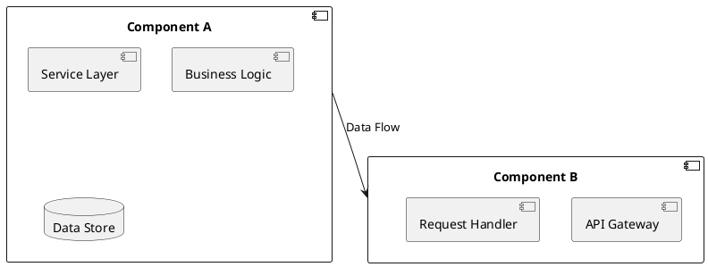
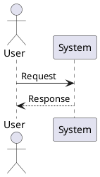
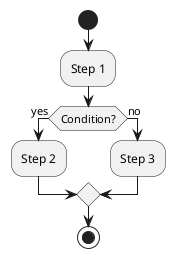

# #1 - RFC Writting Patterns

Date published: 2025-12-11 \
Status: **Approved**

|Author|Jomar Júnior de Souza Pereira|
|---|---|

## 📝 Table of contents

- [🌎 Overview and context](#🌎-overview-and-context)
- [🎯 Goals and requirements](#🎯-goals-and-requirements)
- [🗓️ Timeline and milestones](#🗓️-timeline-and-milestones)
- [✅ Proposal solution](#✅-proposal-solution)
- [🟠 Alternative options](#🟠-alternative-options)
- [❓ Frequently asked questions (FAQ)](#❓-frequently-asked-questions-faq)
- [📎 Apendix](#📎-apendix)
- [📚 References](#📚-references)

## 🌎 Overview and context

This document describes the patterns and best practices for writing **RFC**s (*Request for Comments*) within our organization. The goal is to ensure *clarity*, *consistency*, and *effectiveness* in our RFC documentation process.

### 📑 Glossary and terms

- **RFC**: Request for Comments, a formal document used to propose changes or new features.
- **Author**: The individual who writes and submits the RFC.
- **Reviewer**: The individual(s) who review the RFC for clarity, completeness, and feasibility.
- **Stakeholder**: Any individual or group affected by the RFC.

### 💼 Customer / Business impact

Clearly defined RFCs lead to better communication, reduced misunderstandings, and more efficient implementation of changes, ultimately benefiting the business and its customers.

## 🎯 Goals and requirements

| **Goal** | **Description** |
|---|---|
| Clarity | Ensure that RFCs are easy to understand. |
| Consistency | Maintain a uniform structure across all RFCs. |
| Effectiveness | Facilitate the review and approval process. |
| Accessibility | Make RFCs easily accessible to all stakeholders. |
| Traceability | Ensure that changes can be tracked back to their RFCs. |

### 🚫 Out of scope

- Technical implementation details.
- Post-approval processes.

## 🗓️ Timeline and milestones

| **Milestone** | **Date** |
|---|---|
| Draft Completion | 2025-12-11 |
| Review Period | 2025-12-11 |
| Final Approval | 2025-12-11 |
| Publication | 2025-12-11 |

## ✅ Proposal solution

### RFC Document Structure

All RFCs in the ModelMora project shall follow this standardized template:

#### 1. Header Section

```markdown
# #<number> - <Title>

Date published: YYYY-MM-DD
Status: **Draft | Under Review | Approved | Rejected | Completed**

|Author|<Full Name>|
|---|---|
```

**Status definitions:**

- **Draft**: Initial version, not yet ready for review
- **Under Review**: Currently being reviewed by stakeholders
- **Approved**: Accepted and ready for implementation
- **Rejected**: Not accepted, includes reasoning
- **Completed**: Implementation finished and verified

#### 2. Table of Contents

Must include all major sections with anchors for easy navigation.

#### 3. Overview and Context

**Purpose**: Provide background information and explain why the RFC is needed.

**Required subsections:**

- **Glossary and terms**: Define domain-specific terminology
- **Customer / Business impact**: Describe the value proposition

**Guidelines:**

- Keep it concise (200-400 words)
- Avoid technical jargon in this section
- Focus on the "why" rather than the "how"

#### 4. Goals and Requirements

**Purpose**: Define clear, measurable objectives and constraints.

**Required content:**

- Goals table with descriptions
- Out of scope section (explicitly state what is NOT covered)

**Guidelines:**

- Use SMART criteria (Specific, Measurable, Achievable, Relevant, Time-bound)
- Maximum 5-7 primary goals
- Be explicit about boundaries and limitations

#### 5. Timeline and Milestones

**Purpose**: Establish a project schedule with key dates.

**Required format:**

```markdown
| Milestone | Date |
|---|---|
| Draft Completion | YYYY-MM-DD |
| Review Period | YYYY-MM-DD |
| Final Approval | YYYY-MM-DD |
| Implementation Start | YYYY-MM-DD |
| Implementation Complete | YYYY-MM-DD |
```

**Guidelines:**

- Include realistic timelines
- Account for review cycles
- Add buffer time for unexpected delays

#### 6. Proposal Solution

**Purpose**: Present the recommended approach in detail.

**Required content:**

- Technical design overview
- Architecture diagrams (when applicable)
- Implementation strategy
- Success metrics
- Risk assessment and mitigation

**Guidelines:**

- Use diagrams, flowcharts, and code samples
- Break down complex solutions into subsections
- Include concrete examples
- Reference industry standards (IEEE, IETF, W3C, etc.)

#### 7. Alternative Options

**Purpose**: Document other considered approaches and why they were not chosen.

**Required format:**

```markdown
### Option 1: <Name>
**Description**: ...
**Pros**: ...
**Cons**: ...
**Reason for rejection**: ...
```

**Guidelines:**

- Present at least 2-3 alternatives
- Be objective in evaluation
- Explain trade-offs clearly

#### 8. Frequently Asked Questions (FAQ)

**Purpose**: Address common questions and concerns proactively.

**Guidelines:**

- Include questions raised during drafting
- Add technical clarifications
- Address implementation concerns

#### 9. Appendix

**Purpose**: Provide supplementary information.

**Common items:**

- Detailed technical specifications
- Code examples
- Performance benchmarks
- Security considerations
- Compatibility matrices

#### 10. References

**Purpose**: Cite all external sources and standards.

**Required format:**

```markdown
[1] Author. "Title." Publication, Year. URL
[2] IEEE Standard XXX-YYYY, "Title," Year.
```

### Writing Style Guidelines

#### Language and Tone

- **Clarity**: Use simple, direct language
- **Conciseness**: Eliminate redundant words
- **Consistency**: Maintain uniform terminology
- **Objectivity**: Present facts without bias
- **Precision**: Be specific and unambiguous

#### Formatting Standards

- **Headings**: Use hierarchical markdown headings (H1 → H6)
- **Lists**: Use bullet points for unordered items, numbers for sequences
- **Tables**: Align columns and use consistent spacing
- **Code blocks**: Always specify the language for syntax highlighting
- **Emphasis**: Use **bold** for key terms, *italics* for emphasis

#### Technical Content

- **Diagrams**: Use PlantUML on most cases, ASCII art only when necessary
- **Code samples**: Include complete, runnable examples
- **Metrics**: Quantify impacts with concrete numbers
- **Standards**: Reference specific IEEE, ISO, or IETF standards

### Review and Approval Process

#### Review Stages

1. **Self-review**: Author reviews own RFC for completeness
2. **Peer review**: Technical peers review for accuracy
3. **Stakeholder review**: Business stakeholders review impact
4. **Final approval**: Designated approver(s) sign off

#### Review Checklist

- [ ] All required sections are present
- [ ] Goals are clear and measurable
- [ ] Timeline is realistic
- [ ] Technical solution is detailed
- [ ] Alternatives are considered
- [ ] Risks are identified and mitigated
- [ ] References are complete and accurate
- [ ] Diagrams are clear and accurate
- [ ] Code examples compile/run
- [ ] Grammar and spelling are correct

#### Feedback Process

- Use GitHub Pull Requests for RFC submissions
- Address feedback inline with threaded comments
- Track decisions in the PR description
- Update RFC status based on review outcomes

### Versioning and Updates

#### Version Control

- Store RFCs in `/docs/rfc/` directory
- Use sequential numbering: `#1`, `#2`, `#3`, etc.
- Include date in filename for major revisions: `#1 - RFC Writting Patterns [2025-12-11].md`

#### Amendment Process

For approved RFCs requiring changes:

1. Create new section: "## 📝 Amendments"
2. Document change with date and rationale
3. Update status if needed
4. Notify stakeholders of changes

**Amendment format:**

```markdown
### Amendment 1 - 2025-MM-DD
**Change**: <description>
**Rationale**: <reason>
**Impact**: <scope of change>
```

### IEEE Compliance

This RFC template aligns with IEEE standards, specifically:

- **IEEE 830-1998**: Software Requirements Specifications
- **IEEE 1063-2001**: Software User Documentation
- **IEEE 2001-2002**: Recommended Practice for Internet Practices

**Key IEEE principles applied:**

1. **Completeness**: All necessary information is included
2. **Consistency**: Uniform terminology and structure
3. **Correctness**: Accurate technical content
4. **Modifiability**: Clear versioning and amendment process
5. **Traceability**: References and decision documentation
6. **Verifiability**: Measurable goals and success criteria

## 🟠 Alternative options

### Option 1: Lightweight Markdown Documents

**Description**: Use simple markdown files without strict structure or templates.

**Pros**:

- Faster to write
- Less overhead
- More flexibility

**Cons**:

- Inconsistent documentation
- Missing critical information
- Difficult to review systematically
- Poor traceability

**Reason for rejection**: Lack of structure leads to incomplete proposals and miscommunication, especially in complex technical decisions.

### Option 2: Adopt IETF RFC Format Strictly

**Description**: Follow the exact IETF RFC format (RFC 7322) with ASCII text files.

**Pros**:

- Industry-standard format
- Well-documented process
- Proven track record

**Cons**:

- Too formal for internal use
- Limited formatting options
- Steep learning curve
- Not optimized for diagrams/code

**Reason for rejection**: While excellent for internet standards, IETF format is overly formal for internal software project RFCs and lacks modern markdown features.

### Option 3: Use Architecture Decision Records (ADRs)

**Description**: Implement lightweight ADR format (MADR template).

**Pros**:

- Simple and focused
- Quick to write
- Good for small decisions

**Cons**:

- Too brief for complex proposals
- Lacks business context
- No timeline tracking
- Limited structure for large changes

**Reason for rejection**: ADRs are complementary but insufficient for comprehensive project proposals requiring business impact analysis and detailed timelines.

## ❓ Frequently asked questions (FAQ)

### Q1: When should I write an RFC?

**A**: Write an RFC for:

- Major architectural changes
- New features affecting multiple components
- Changes to public APIs or interfaces
- Process or workflow modifications
- Decisions with long-term impact

Do NOT write an RFC for:

- Bug fixes
- Minor refactoring
- Documentation updates
- Routine maintenance

### Q2: How long should an RFC be?

**A**: Typical length ranges:

- **Simple proposals**: 2-4 pages
- **Standard proposals**: 5-10 pages
- **Complex proposals**: 10-20 pages

Focus on clarity over length. Include enough detail for informed decision-making.

### Q3: Who should review my RFC?

**A**: Required reviewers:

- Technical lead for the affected component
- At least 2 peers with relevant expertise
- Product owner or business stakeholder
- Security/compliance team (for security-related changes)

### Q4: Can I update an approved RFC?

**A**: Yes, through the amendment process:

1. Add amendment section with date and details
2. Submit as PR for review
3. Get approval from original approvers
4. Update RFC status if scope changes significantly

### Q5: What if my RFC is rejected?

**A**: Document the rejection:

1. Update status to "Rejected"
2. Add rejection rationale
3. Keep the RFC for historical reference
4. Consider alternative approaches or resubmit with modifications

### Q6: Should I include code in RFCs?

**A**: Yes, when it helps clarify the proposal:

- Use code snippets for API designs
- Show before/after examples
- Include pseudocode for algorithms
- Keep examples concise and relevant

### Q7: How do I handle confidential information?

**A**:

- Mark RFC as "Confidential" in header
- Store in private repository if needed
- Redact sensitive details in public versions
- Follow company security policies

### Q8: What's the difference between RFC and design documents?

**A**:

- **RFC**: Proposes changes, seeks approval, includes alternatives
- **Design doc**: Details implementation of approved RFC
- RFCs answer "what and why", design docs answer "how"

## 📎 Apendix

### A. Complete RFC Template

```markdown
# #<number> - <Title>

Date published: YYYY-MM-DD
Status: **Draft**

|Author|<Full Name>|
|---|---|

## 📝 Table of contents

- [🌎 Overview and context](#🌎-overview-and-context)
- [🎯 Goals and requirements](#🎯-goals-and-requirements)
- [🗓️ Timeline and milestones](#🗓️-timeline-and-milestones)
- [✅ Proposal solution](#✅-proposal-solution)
- [🟠 Alternative options](#🟠-alternative-options)
- [❓ Frequently asked questions (FAQ)](#❓-frequently-asked-questions-faq)
- [📎 Apendix](#📎-apendix)
- [📚 References](#📚-references)

## 🌎 Overview and context

[Provide background and motivation]

### 📑 Glossary and terms

- **Term 1**: Definition
- **Term 2**: Definition

### 💼 Customer / Business impact

[Describe value and impact]

## 🎯 Goals and requirements

| **Goal** | **Description** |
|---|---|
| Goal 1 | Description |

### 🚫 Out of scope

- Item 1
- Item 2

## 🗓️ Timeline and milestones

| **Milestone** | **Date** |
|---|---|
| Draft Completion | YYYY-MM-DD |

## ✅ Proposal solution

[Detailed proposal]

## 🟠 Alternative options

### Option 1: [Name]
**Description**: ...
**Pros**: ...
**Cons**: ...
**Reason for rejection**: ...

## ❓ Frequently asked questions (FAQ)

### Q: Question?
**A**: Answer

## 📎 Apendix

[Supplementary information]

## 📚 References

[1] Citation
```

### B. Example Diagrams

#### Example 1: Architecture Diagram



#### Example 2: Sequence Diagram



#### Example 3: Flowchart



### C. Status Transition Matrix

| From → To | Valid | Requires |
|---|---|---|
| Draft → Under Review | ✅ | Complete all sections |
| Under Review → Draft | ✅ | Major revision needed |
| Under Review → Approved | ✅ | All reviewers approve |
| Under Review → Rejected | ✅ | Document rationale |
| Approved → Completed | ✅ | Implementation verified |
| Approved → Under Review | ⚠️ | Significant changes only |
| Rejected → Draft | ✅ | Substantial rework |

### D. Checklist for Authors

**Before Submission:**

- [x] RFC number assigned sequentially
- [x] All sections completed
- [x] Spell-check and grammar review
- [x] Technical accuracy verified
- [x] Code examples tested
- [x] Diagrams are clear
- [x] References cited properly
- [x] Out of scope explicitly stated

**During Review:**

- [x] Respond to all comments
- [x] Update RFC based on feedback
- [x] Maintain change log
- [x] Address stakeholder concerns

**After Approval:**

- [x] Update status to "Approved"
- [x] Create implementation tickets
- [x] Notify relevant teams
- [x] Archive in documentation

### E. Common Pitfalls to Avoid

1. **Vague goals**: Use measurable, specific objectives
2. **Missing alternatives**: Always consider other approaches
3. **No timeline**: Include realistic dates and milestones
4. **Scope creep**: Clearly define what's out of scope
5. **Insufficient detail**: Provide enough information for implementation
6. **Ignoring feedback**: Address all review comments
7. **No success metrics**: Define how to measure success
8. **Missing risks**: Identify and plan for potential issues

## 📚 References

[1] IEEE Computer Society. "IEEE Standard for Software Requirements Specifications," IEEE Std 830-1998, 1998.

[2] IEEE Computer Society. "IEEE Standard for Software User Documentation," IEEE Std 1063-2001, 2001.

[3] Internet Engineering Task Force. "RFC 7322: RFC Style Guide," IETF, September 2014. <https://www.rfc-editor.org/rfc/rfc7322>

[4] Nygard, M. "Documenting Architecture Decisions," 2011. <https://cognitect.com/blog/2011/11/15/documenting-architecture-decisions>

[5] IEEE Computer Society. "IEEE Recommended Practice for Internet Practices—Web Page Engineering—Intranet/Extranet Applications," IEEE Std 2001-2002, 2002.

[6] The Linux Foundation. "CONTRIBUTING.md Guide," Best Practices for Open Source Projects, 2023.

[7] GitLab. "RFC Process," GitLab Handbook. <https://about.gitlab.com/handbook/engineering/architecture/workflow/>

[8] Atlassian. "Decision Records," Agile at Scale Documentation, 2024.
